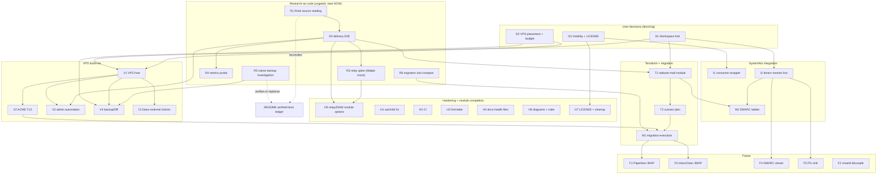

# NIX-EMAIL PARETO SUPERB EXECUTION PLAN

|                |                                                                                                                                                                                                                  |
| -------------- | ---------------------------------------------------------------------------------------------------------------------------------------------------------------------------------------------------------------- |
| **Date**       | 2026-09-14, 18:37 CEST                                                                                                                                                                                           |
| **Scope**      | ALL open work for the nix-email project (from status report 2026-09-14_17-05 + brutal self-review 17-20 + session context)                                                                                       |
| **Goal**       | Fully comprehensive, superb, LIGHT Nix email management, plugged into SystemNix                                                                                                                                  |
| **Guard rail** | NO VERSCHLIMMBESSERN: never touch SystemNix's working `mail-relay.nix`, never weaken a green test, never rewrite committed history, every new fact goes through the verified-facts ledger (fact + method + date) |
| **Gates**      | D1/D2/D3 are USER decisions (asked in status report section g); they block the VPS/migration tier only — the research tier is fully ungated                                                                      |

---

## 1. Pareto Breakdown

### The 1% that delivers 51%

**Prove Stalwart actually DELIVERS mail through our module** (R2: account bootstrap via management API → SMTP accept → mailbox delivery → IMAP fetch, in the VM test). One green test converts the repo from "listener wrapper with a rejection proof" into "validated mail system" — and every downstream decision (VPS, migration, Workspace retirement) stops being a bet.

### The 4% that delivers 64%

**The full research-as-code suite** (R1-R6): delivery E2E, smarthost-relay spike against a Mailpit mock upstream, metrics endpoint probe, native backup mechanism investigation, migration tooling comparison, finish reading the two source reports. These close ALL unverified facts; the VPS config, Terraform records, and README runbook are then written from knowledge, not folklore.

### The 20% that delivers 80%

Research suite **plus** module hardening from its findings (H-tier: relay/DKIM defaults, aarch64 fix, CI, formatter, docs-health files, LICENSE) **plus** the SystemNix consumer wrapper (I-tier). End state: evo-x2-side comprehensive monitoring is real, the repo is production-grade, and every remaining step is de-risked.

### The other 20% (to reach 100%)

The VPS build-out, real TLS, admin automation, Terraform records, migration with rollback window, backup/DR, DMARC ladder, and downstream consumers (Paperless IMAP, smartd decoupling, InboxClean JMAP, viewer). Gated on D1/D2 — mostly not startable before the decisions.

---

## 2. Comprehensive Plan — Medium Granularity (30-100 min per task, ALL TODOs)

Sort: tier (decisions → research → hardening → integration → VPS → migration → future), then impact/effort.

| ID     | Task                                                                                                                                                                                                                                                         | Tier          | Impact       | Effort  | Blocked by            | Customer value                                                                         |
| ------ | ------------------------------------------------------------------------------------------------------------------------------------------------------------------------------------------------------------------------------------------------------------ | ------------- | ------------ | ------- | --------------------- | -------------------------------------------------------------------------------------- |
| D1     | DECIDE: retire Google Workspace mailboxes for Stalwart VPS vs keep Workspace (monitoring-only)                                                                                                                                                               | Decision      | Critical     | 10m     | user only             | Gates VPS scope, migration, cost, availability risk                                    |
| D2     | DECIDE: VPS placement (which Hetzner project), size ceiling (CX22-class?), backup target (pool vs StorageBox)                                                                                                                                                | Decision      | Critical     | 10m     | user only             | Gates provisioning + backup design                                                     |
| D3     | DECIDE: repo visibility ~~(public vs private git+ssh)~~ + LICENSE                                                                                                                                                                                            | Decision      | High         | 10m     | user only             | Visibility decided: **public** (published 2026-09-14); LICENSE choice open, ROADMAP Q3 |
| ~~R1~~ | ~~Finish reading `selfhosted-email-guide.md` (200-560) + monitoring report tail; reconcile README runbook; verify-or-delete Hetzner :25 sentence~~ done — 2026-09-14 - source reading finished, Hetzner claim verified against official docs (README ledger) | ~~Research~~  | ~~Critical~~ | ~~30m~~ | ~~-~~                 | ~~Kills 2 memory-claims; runbook becomes source-derived~~                              |
| ~~R2~~ | ~~Delivery E2E VM test: provision account via Stalwart management API → SMTP → mailbox → IMAP fetch~~ done at `fbe9ca9`                                                                                                                                      | ~~Research~~  | ~~Critical~~ | ~~90m~~ | ~~-~~                 | ~~THE 51% proof; unblocks admin-automation design~~                                    |
| R3     | Smarthost relay spike: ~~Mailpit as mock submission upstream in VM, verify `queue.*` keys on 0.15.5~~ mechanism VERIFIED locally (`c927922`; loopback guard blocks the VM path)                                                                              | Research      | Critical     | 90m     | -                     | Round-trip two-node VM test in TODO_LIST; the real Resend path waits for D2            |
| ~~R4~~ | ~~Metrics endpoint probe (local binary + VM), codify assertion, wire Gatus shape~~ done — metrics keys + endpoint verified (README ledger)                                                                                                                   | ~~Research~~  | ~~High~~     | ~~30m~~ | ~~-~~                 | ~~Closes ledger unverified-fact #1~~                                                   |
| ~~R5~~ | ~~Stalwart native backup/export manager investigation; verify or replace the btrfs+borg assumption~~ done — native --export backup verified (README ledger)                                                                                                  | ~~Research~~  | ~~Critical~~ | ~~45m~~ | ~~-~~                 | ~~Backup/DR design stops being folklore~~                                              |
| R6     | Migration tooling: stalwart-vandelay vs imapsync on a scratch mailbox; decide + document                                                                                                                                                                     | Research      | High         | 45m     | -                     | Migration runbook picks the right tool                                                 |
| ~~H1~~ | ~~Fix aarch64 check trap: restrict `stalwart-e2e` to x86_64-linux~~ done at `8bfddfe`                                                                                                                                                                        | ~~Hardening~~ | ~~High~~     | ~~30m~~ | ~~-~~                 | ~~Prevents a future slow-TCG CI surprise~~                                             |
| H2     | CI workflow (adapted nix-check.yml: flake check + input hygiene + fail-closed)                                                                                                                                                                               | Hardening     | High         | 60m     | -                     | Every push gated like sibling repos                                                    |
| H3     | Formatter + pre-commit: treefmt/alejandra/statix/deadnix, run over repo                                                                                                                                                                                      | Hardening     | Medium       | 45m     | -                     | Repo matches LarsArtmann conventions                                                   |
| ~~H4~~ | ~~docs-health BUILD: TODO_LIST.md, FEATURES.md, ROADMAP.md, CHANGELOG.md from status report~~ done (docs-health pass 2026-09-15)                                                                                                                             | ~~Hardening~~ | ~~High~~     | ~~60m~~ | ~~-~~                 | ~~Living task source exists (plans are snapshots)~~                                    |
| H5     | Module defaults from spike findings: `services.mail-server.relay.*` option + DKIM defaults + ledger updates                                                                                                                                                  | Hardening     | Critical     | 90m     | R2,R3                 | Module becomes deployable, not just evaluable                                          |
| H6     | d2 architecture diagram in README + ~~AGENTS.md rules (assertions-from-transcripts, no-pipes-on-gates)~~ (`95d5dcb` + 2026-09-15)                                                                                                                            | Hardening     | Medium       | 30m     | -                     | Diagram task open in TODO_LIST                                                         |
| H7     | LICENSE + ~~.gitignore polish~~ (`21cab2c`) + ~~`/tmp/swtest` cleanup~~ (verified gone)                                                                                                                                                                      | Hardening     | Medium       | 30m     | D3                    | LICENSE blocked on the license choice (ROADMAP Q3)                                     |
| I1     | SystemNix: add `nix-email` flake input + consumer wrapper skeleton (ports.nix, sops, onFailure, harden)                                                                                                                                                      | Integration   | Critical     | 90m     | D3                    | The "pluggable into SystemNix" promise becomes real                                    |
| I2     | SystemNix: `dmarc-monitor` live wiring on evo-x2 (sops IMAP secret, Gatus liveness, backup-coordination)                                                                                                                                                     | Integration   | High         | 90m     | D1 (mailbox location) | Domains-repo H1/H2 (rua blindness) finally closed                                      |
| I3     | SystemNix: Gatus starttls/tls/cert-expiry checks for `mail.<domain>`                                                                                                                                                                                         | Integration   | High         | 30m     | VPS live              | External-viewpoint uptime + cert monitoring                                            |
| V1     | VPS host: NixOS system entry + Hetzner provisioning (domains cloud-init path) + rDNS/PTR + bootstrap runbook                                                                                                                                                 | VPS           | Critical     | 100m    | D1,D2                 | The MX exists                                                                          |
| V2     | Real TLS on VPS: ACME config, replace self-signed default, verify imaps/submissions certs                                                                                                                                                                    | VPS           | Critical     | 60m     | V1                    | No client cert warnings; MTA-STS-ready                                                 |
| V3     | Admin bootstrap automation: wizard → provisioning oneshot/API (from R2 knowledge)                                                                                                                                                                            | VPS           | High         | 90m     | R2,V1                 | Reproducible rebuild (DR)                                                              |
| V4     | Backup/DR: chosen mechanism (R5) unit + borg pull to target + recovery age key in sops key group                                                                                                                                                             | VPS           | Critical     | 90m     | V1,R5,D2              | Rebuild-without-losing-secrets story complete                                          |
| T1     | Terraform `stalwart-mail` module in domains repo: MX, SPF, DKIM, DMARC-rua, MTA-STS, TLS-RPT + tests                                                                                                                                                         | Terraform     | Critical     | 100m    | D1,R2                 | DNS truth for the mail estate                                                          |
| T2     | DNS cutover plan: TTL lowering, dual-MX window, rollback steps (docs only)                                                                                                                                                                                   | Terraform     | High         | 45m     | T1                    | No-surprise cutover                                                                    |
| M1     | Mailbox migration execution: runbook (R6 tool), Workspace→Stalwart, verify per-account parity                                                                                                                                                                | Migration     | Critical     | 100m    | T1,V2,M-prep          | Users keep their mail                                                                  |
| M2     | DMARC ladder rollout: parsedmarc data → none→quarantine→reject per domain, 2-4 week schedule                                                                                                                                                                 | Migration     | High         | 60m     | I2,T1                 | Spoofing protection actually enforced                                                  |
| F1     | Downstream: Paperless mail accounts → own IMAP (kill Gmail app passwords)                                                                                                                                                                                    | Future        | Medium       | 60m     | M1                    | Fewer third-party credentials                                                          |
| F2     | Downstream: smartd remote alert path off the mail relay (break circular dependency)                                                                                                                                                                          | Future        | Medium       | 30m     | -                     | Alerting survives mail outages                                                         |
| F3     | Downstream: InboxClean JMAP/IMAP spike (post-migration)                                                                                                                                                                                                      | Future        | Medium       | 100m    | M1                    | Assistant follows the mailboxes                                                        |
| F4     | DMARC viewer prototype over JSON/CSV                                                                                                                                                                                                                         | Future        | Medium       | 100m    | I2                    | The report's gap #3, closed                                                            |
| F5     | psycopg override experiment for parsedmarc PostgreSQL sink                                                                                                                                                                                                   | Future        | Low          | 60m     | I2                    | Optional queryable sink                                                                |

Counts: 33 tasks (3 decisions, 6 research, 7 hardening, 3 integration, 4 VPS, 2 terraform, 2 migration, 5 future, +cleanup folded into H7).

---

## 3. Fine-Grained Breakdown — ALL TODOs, max 12 min each

_Micro-task statuses follow their section-2 parents (see the markers above
and the appendix below)._

Micro-task IDs encode the parent (`R2.3` = step 3 of R2). Every parent from section 2 is fully decomposed.

| ID   | Micro-task (each ≤12min)                                                                         | Impact   | Est |
| ---- | ------------------------------------------------------------------------------------------------ | -------- | --- |
| D1.1 | Present D1 decision memo (costs, risks, both paths consume repo unchanged) to user               | Critical | 10m |
| D2.1 | Present D2 memo (project/budget/backup-target options with prices) to user                       | Critical | 10m |
| D3.1 | Present D3 memo (visibility tradeoffs, input-URL shapes, license options) to user                | High     | 10m |
| R1.1 | Read selfhosted-email-guide lines 200-400                                                        | Critical | 12m |
| R1.2 | Read selfhosted-email-guide lines 400-560                                                        | Critical | 12m |
| R1.3 | Read monitoring report lines 500-end (references)                                                | Medium   | 10m |
| R1.4 | Diff guide's DNS section vs README runbook; list deltas                                          | High     | 12m |
| R1.5 | Verify-or-delete Hetzner outbound-25 sentence (their docs)                                       | Medium   | 10m |
| R1.6 | Apply README runbook corrections + ledger entries                                                | High     | 12m |
| R2.1 | Discover management-API auth mechanism (binary strings + webadmin zip)                           | High     | 12m |
| R2.2 | Write account-provision call (curl/JMAP) as a test helper script                                 | High     | 12m |
| R2.3 | Wire provision step into testScript before send                                                  | High     | 12m |
| R2.4 | swaks send to provisioned account (extend existing subtest)                                      | High     | 12m |
| R2.5 | IMAP fetch via python imaplib; assert subject/body round-trip                                    | High     | 12m |
| R2.6 | Handle DNS-stall timeouts in delivery path (reuse --timeout 120 lesson)                          | Medium   | 12m |
| R2.7 | Full `nix flake check` green (no pipes on gates)                                                 | High     | 12m |
| R2.8 | Ledger: delivery-E2E facts (API auth, mailbox path, gotchas)                                     | High     | 12m |
| R3.1 | Add Mailpit instance (services.mailpit) to the VM test node                                      | High     | 12m |
| R3.2 | Find 0.15.5 smarthost key candidates (binary strings: queue/next-hop/route)                      | High     | 12m |
| R3.3 | Configure first candidate; local-binary loop with Mailpit upstream                               | High     | 12m |
| R3.4 | Verify mail ARRIVES in Mailpit API (`/api/v1/messages`)                                          | High     | 12m |
| R3.5 | Port working keys into VM test as an assertion                                                   | High     | 12m |
| R3.6 | Test AUTH to upstream (credential indirection via services.stalwart.credentials)                 | Medium   | 12m |
| R3.7 | Ledger + README: verified relay recipe                                                           | High     | 12m |
| R4.1 | Probe http listener paths (/metrics, /api/metrics/export) with local binary                      | Medium   | 12m |
| R4.2 | Codify whichever exists into a VM-test assertion                                                 | Medium   | 12m |
| R4.3 | Document scrape shape for Gatus/Prometheus in README                                             | Medium   | 10m |
| R5.1 | Extract backup.rs behavior: binary strings + webadmin settings keys                              | High     | 12m |
| R5.2 | Run a native export on the local /tmp instance; inspect output format                            | High     | 12m |
| R5.3 | Restore test: import into a fresh store; verify integrity                                        | High     | 12m |
| R5.4 | Decide native-export vs snapshot+borg; write verdict + rationale in README                       | High     | 12m |
| R6.1 | Read vandelay docs/help (stalwart-cli import/export)                                             | Medium   | 12m |
| R6.2 | Dry-run vandelay import of a handful of .eml into scratch Stalwart                               | Medium   | 12m |
| R6.3 | Dry-run imapsync between two scratch IMAP endpoints                                              | Medium   | 12m |
| R6.4 | Compare (fidelity, flags, folders, speed, deps); decide + document                               | Medium   | 12m |
| H1.1 | Restructure checks attrset: VM test x86_64-only, dmarc-eval both arches                          | High     | 10m |
| H1.2 | `nix flake check` green on x86_64; eval-only proof for aarch64                                   | High     | 10m |
| H2.1 | Copy SystemNix nix-check.yml; strip private-dep steps                                            | High     | 12m |
| H2.2 | Adapt to flake-parts-less flake (plain outputs); add fail-closed Files>0-style guards            | High     | 12m |
| H2.3 | First green CI run on push                                                                       | High     | 12m |
| H3.1 | Add treefmt config (alejandra + md formatter)                                                    | Medium   | 12m |
| H3.2 | Run formatter; commit mechanical diff alone                                                      | Medium   | 12m |
| H3.3 | Add statix + deadnix checks; fix findings                                                        | Medium   | 12m |
| H3.4 | Add .pre-commit-config.yaml (minimal, no gitleaks secrets needed yet)                            | Low      | 12m |
| H4.1 | Create TODO_LIST.md from this plan's ungated tasks                                               | High     | 12m |
| H4.2 | Create FEATURES.md (DONE/PARTIAL/PLANNED)                                                        | High     | 12m |
| H4.3 | Create ROADMAP.md (future tier, viewer, JMAP, postgres sink)                                     | Medium   | 12m |
| H4.4 | Create CHANGELOG.md with foundation entry                                                        | Medium   | 10m |
| H5.1 | Design `services.mail-server.relay.*` option shape from R3 findings                              | Critical | 12m |
| H5.2 | Implement option → settings mapping (mkDefaults)                                                 | Critical | 12m |
| H5.3 | Relay assertions (fail eval when relay enabled without credential)                               | High     | 12m |
| H5.4 | DKIM defaults: signing enable + key handling decision from R2 findings                           | High     | 12m |
| H5.5 | Extend VM tests to cover relay option path                                                       | High     | 12m |
| H5.6 | README option docs + ledger update                                                               | High     | 10m |
| H6.1 | Write d2 diagram (hosts, flows, decisions) and embed in README                                   | Medium   | 12m |
| H6.2 | Add AGENTS.md rules: assertions-from-transcripts, no-pipes-on-gates, commit-per-green-checkpoint | Medium   | 10m |
| H7.1 | LICENSE file per D3                                                                              | Medium   | 10m |
| H7.2 | `trash /tmp/swtest`; verify gone                                                                 | Low      | 2m  |
| H7.3 | README/AGENTS pass for stale claims (doc-freshness)                                              | Medium   | 12m |
| I1.1 | Add flake input to SystemNix (URL per D3); lock                                                  | Critical | 12m |
| I1.2 | Create modules/nixos/services/nix-email.nix wrapper (enable gate only)                           | Critical | 12m |
| I1.3 | Port registration in lib/ports.nix (dmarc has no port; document)                                 | High     | 10m |
| I1.4 | sops template for parsedmarc IMAP password (placeholder pattern)                                 | High     | 12m |
| I1.5 | onFailure → Discord routing on the parsedmarc unit                                               | High     | 12m |
| I1.6 | Gatus liveness + functional checks (unit-state + output-dir freshness)                           | High     | 12m |
| I1.7 | Homepage tile + backup-coordination entry for reports dir                                        | Medium   | 12m |
| I1.8 | SystemNix VM/eval test for the wrapper (mock-sops pattern)                                       | High     | 12m |
| I2.1 | Decide rua mailbox address per D1 outcome; create mailbox                                        | High     | 12m |
| I2.2 | Point domains-repo DMARC rua records at it (coordination with T1)                                | High     | 12m |
| I2.3 | Enable dmarc-monitor on evo-x2 with real secret; watch first poll                                | High     | 12m |
| I2.4 | Verify first aggregate report lands as JSON/CSV; fix mailbox filters                             | High     | 12m |
| I2.5 | Gatus check: parsedmarc service healthy + reports dir non-empty                                  | Medium   | 12m |
| I3.1 | Add the two Gatus endpoints (starttls 25/587, tls 993, cert-expiry 720h)                         | High     | 12m |
| I3.2 | Verify from evo-x2 against live VPS; alert routing test                                          | High     | 12m |
| V1.1 | Write systems/mail-vps.nix skeleton importing mail-server module                                 | Critical | 12m |
| V1.2 | Hetzner provision: reuse domains-repo cloud-init; bootstrap NixOS                                | Critical | 12m |
| V1.3 | Set rDNS/PTR at Hetzner to mail hostname                                                         | Critical | 10m |
| V1.4 | Firewall: allow 25/465/587/993; admin loopback-only via SSH tunnel                               | High     | 12m |
| V1.5 | sops key setup: host key + recovery age key in key group                                         | High     | 12m |
| V1.6 | First deploy + I3 Gatus checks green                                                             | Critical | 12m |
| V1.7 | Bootstrap runbook doc (docs/services/mail-vps.md)                                                | High     | 12m |
| V2.1 | Stalwart ACME config (http-01 via the mail vhost or standalone)                                  | High     | 12m |
| V2.2 | Drop self-signed default on VPS host; verify cert chain                                          | High     | 12m |
| V2.3 | MTA-STS/TLS-RPT readiness check (with T1 records)                                                | Medium   | 12m |
| V3.1 | Translate R2 provision script into a systemd oneshot (idempotent)                                | High     | 12m |
| V3.2 | Secrets for admin bootstrap via sops; first-boot test                                            | High     | 12m |
| V3.3 | DR drill: rebuild VPS from nix + backups + oneshot (documented timing)                           | High     | 12m |
| V4.1 | Implement chosen backup mechanism as timer unit                                                  | Critical | 12m |
| V4.2 | Borg/restic pull job to D2 target; retention policy                                              | Critical | 12m |
| V4.3 | Register in SystemNix backup-coordination (staggered schedule)                                   | High     | 12m |
| V4.4 | Restore drill from backup to scratch VM                                                          | Critical | 12m |
| T1.1 | Module skeleton + variables (domain, hostname, dkim selector, rua)                               | Critical | 12m |
| T1.2 | MX + SPF records                                                                                 | Critical | 12m |
| T1.3 | DKIM TXT from Stalwart-generated key                                                             | Critical | 12m |
| T1.4 | DMARC with rua + TLS-RPT records                                                                 | Critical | 12m |
| T1.5 | MTA-STS: sts TXT + well-known vhost record source                                                | High     | 12m |
| T1.6 | tftest.hcl tests (pattern-match sibling modules)                                                 | High     | 12m |
| T1.7 | Wire first domain (canary), `terraform plan` review                                              | Critical | 12m |
| T2.1 | Write cutover runbook: TTL drop, dual-MX, per-account parity checks, rollback                    | High     | 12m |
| M1.1 | Canary account migration with chosen tool; verify folder/flag parity                             | Critical | 12m |
| M1.2 | Batch migration per domain; monitor queue + errors                                               | Critical | 12m |
| M1.3 | MX switch on canary domain; soak 48h; then remaining                                             | Critical | 12m |
| M1.4 | Workspace rollback window (keep 2 weeks); final decommission decision log                        | High     | 12m |
| M2.1 | parsedmarc data review script (pass rates per domain)                                            | High     | 12m |
| M2.2 | Ladder schedule per domain (none→quarantine→reject) with dates                                   | High     | 12m |
| M2.3 | Apply ladder via T1 module; verify via reports                                                   | High     | 12m |
| F1.1 | Create scanner/forwarding mailbox on Stalwart                                                    | Medium   | 12m |
| F1.2 | Repoint Paperless mail account + rules; verify consumption                                       | Medium   | 12m |
| F2.1 | Switch smartd remote alert to Discord webhook path (SystemNix change)                            | Medium   | 12m |
| F3.1 | JMAP client library survey for Go (go-cqrs-lite ecosystem fit)                                   | Medium   | 12m |
| F3.2 | Prototype fetch-only JMAP reader against VPS                                                     | Medium   | 12m |
| F4.1 | JSON schema review of parsedmarc output; viewer data model                                       | Medium   | 12m |
| F4.2 | Static viewer prototype (single HTML over generated JSON)                                        | Medium   | 12m |
| F5.1 | parsedmarc override with psycopg; local IMAP+PG integration run                                  | Low      | 12m |

Fine-grained total: 118 micro-tasks, each ≤12 min.

---

## 4. Execution Graph

**Execution order while decisions pend:** H1 → R1 → R2 → R3/R4/R5/R6 (parallel) → H2/H3/H4/H6 → H5 → H7/I1 after D3.

---

## 5. What "done" means (verification gates)

- Every research task ends with: ledger entry (fact + method + date) or a deleted claim
- Every module change ends with: `nix flake check` exit=0, no pipes on the gate command
- Every SystemNix change ends with: its own VM/eval test green + Gatus check present
- Every migration step ends with: per-account parity evidence before the next step
- Nothing in SystemNix's working mail-relay path is modified by this plan

_Plan snapshot written 2026-09-14 18:37 CEST. Living copies of these tasks belong in TODO_LIST.md (~~H4~~ done 2026-09-15 — they live there now; long-term/gated work in ROADMAP.md)._

---

## Status at annotation (2026-09-15, docs-health pass)

| Tier                                 | State                                                                                                      |
| ------------------------------------ | ---------------------------------------------------------------------------------------------------------- |
| Decisions                            | D3 visibility decided (public); D1, D2, and the license choice open (ROADMAP "Open questions")             |
| Research                             | R1, R2, R4, R5 done; R3 mechanism verified (round-trip VM test in TODO_LIST); R6 blocked on D1             |
| Hardening                            | H1, H4 done; H6, H7 partially done; H2 (CI), H3 (nix formatter), H5 (relay/DKIM options) open in TODO_LIST |
| Integration                          | I1 unblocked (repo public), in TODO_LIST; I2, I3 gated on D1/VPS                                           |
| VPS / Terraform / Migration / Future | Gated on D1/D2 - ROADMAP themes                                                                            |
