# NIX-EMAIL POST-FOUNDATION PARETO EXECUTION PLAN

|                |                                                                                                                                                                                                                                                                                      |
| -------------- | ------------------------------------------------------------------------------------------------------------------------------------------------------------------------------------------------------------------------------------------------------------------------------------ |
| **Date**       | 2026-09-15, 04:56 CEST                                                                                                                                                                                                                                                               |
| **Scope**      | ALL open work for the nix-email project: TODO_LIST.md (33 rows, verified 2026-09-15) + ROADMAP.md gated themes + open questions + the 2026-09-15 session-born items. Supersedes the 2026-09-14_18-37 plan (whose ungated tiers H1/H4, R1-R5 are done — see its annotated tier table) |
| **Goal**       | Fully comprehensive, superb, LIGHT Nix email management, plugged into SystemNix, with the gated production estate de-risked and ready                                                                                                                                                |
| **Guard rail** | NO VERSCHLIMMBESSERN: never weaken a green test, never rewrite committed history, never fight the auto-commit daemon mid-edit, every new Stalwart/parsedmarc fact goes through the README verified-facts ledger (fact + method + date), gate commands never wear pipes               |
| **Gates**      | D1 (Workspace fork), D2 (VPS placement/budget), D3 (license) are USER decisions — they gate the VPS/DNS/migration/monitoring tiers only; integration, quality, tests, and module options are FULLY UNGATED                                                                           |
| **Baseline**   | `nix flake check` green (VM E2E incl. firewall fix); repo public; 9 local commits pending push (push authorized this session)                                                                                                                                                        |

---

## 1. Pareto Breakdown

### The 1% that delivers 51%

**D1 answered + the SystemNix consumer wrapper (C1).** D1 is a 10-minute user answer that decides whether half this plan is scope at all. C1 (90 min) converts the repo's founding promise — "pluggable into SystemNix" — into a working import; every later task (monitoring live, VPS host, Gatus) assembles onto that consumer shape instead of inventing one per task.

### The 4% that delivers 64%

**The three decisions (D1/D2/D3) + the full consumer integration (C1-C4) + CI (Q1).** End state: pushes are gated like every sibling repo, SystemNix consumes both modules with secrets/alerting/checks, and the entire downstream estate has a defined shape. The monitoring half can go live from here without any VPS.

### The 20% that delivers 80%

The 4% tier **plus** the module options that make a VPS deployment declarative (M1-M4: relay, certificate tier, metrics, cache TTL) **plus** the four load-bearing tests (T1 two-node relay, T2 DKIM, T3 restart-persistence, T5 backup/restore drill). End state: everything short of actual infrastructure is built and test-proven; the VPS build-out becomes config assembly from verified recipes, not research.

### The other 20% (to reach 100%)

The D1/D2-gated estate: VPS build-out (V1-V6), Terraform DNS module (F1-F3), mailbox migration (G1-G3), monitoring rollout (N2-N5), downstream consumers (X1-X5), and the repo-polish remainder. Mostly not startable before the decisions; all de-risked by the 20% tier.

---

## 2. Comprehensive Plan — Medium Granularity (30-100 min per task, ALL TODOs)

Sort: decisions → integration (ungated) → quality (ungated) → tests (ungated) → module options (ungated) → VPS → DNS → migration → monitoring → downstream. Impact/effort/customer-value ranked inside tiers.

| ID  | Task                                                                                                                                                               | Tier        | Impact   | Effort | Blocked by        | Customer value                                                         |
| --- | ------------------------------------------------------------------------------------------------------------------------------------------------------------------ | ----------- | -------- | ------ | ----------------- | ---------------------------------------------------------------------- |
| D1  | DECIDE: retire Google Workspace mailboxes for the Stalwart VPS vs keep Workspace (monitoring-only)                                                                 | Decision    | Critical | 10m    | user only         | Gates V/F/G/N/X tiers entirely; three sessions have asked              |
| D2  | DECIDE: VPS placement (Hetzner project/location), size ceiling (CX22-class?), backup target (pool vs StorageBox)                                                   | Decision    | Critical | 10m    | user only         | Gates provisioning + backup design                                     |
| D3  | DECIDE: LICENSE (MIT recommended; AGPL Stalwart is wrapped, not relicensed)                                                                                        | Decision    | High     | 10m    | user only         | Gates LICENSE row, GitHub metadata, CI public-cache path               |
| ~~C1~~  | ~~SystemNix: `nix-email` flake input + consumer wrapper skeleton (`modules/nixos/services/nix-email.nix`, enable gates) + ports.nix registration~~ done — SystemNix consumer wrapper shipped (pins tag v0.2.0, contract test green) | ~~Integration~~ | ~~Critical~~ | ~~90m~~ | ~~-~~ | ~~THE 51% move: the pluggable promise becomes real~~ |
| ~~C2~~  | ~~SystemNix: sops templates (fallback-admin secret, relay secret placeholder) + `services.stalwart.credentials` wiring + onFailure→Discord~~ done — sops templates + credentials + onFailure shipped in the SystemNix wrapper | ~~Integration~~ | ~~High~~ | ~~60m~~ | ~~C1~~ | ~~Secrets never in the store; failures page Lars~~ |
| C3  | SystemNix: Gatus checks (unit liveness, reports-dir freshness) + homepage tile + backup-coordination entry                                                         | Integration | High     | 60m    | C1                | The mail stack is a first-class citizen on evo-x2                      |
| ~~C4~~  | ~~SystemNix: eval + VM test importing the upstream module (mock-sops pattern)~~ done — tests/test-nix-email.nix shipped (13 assertions, relay assertions restored at v0.2.0) | ~~Integration~~ | ~~High~~ | ~~60m~~ | ~~C1~~ | ~~Consumer wiring stays green like the upstream gate~~ |
| ~~Q1~~  | ~~CI: GitHub Action `nix flake check`, fail-closed, asserts checks actually ran (Files>0-class guard)~~ done — CI shipped in v0.2.0 (598db0f) | ~~Quality~~ | ~~High~~ | ~~60m~~ | ~~-~~ | ~~Every push gated like sibling repos; no false greens~~ |
| ~~Q2~~  | ~~Nix formatter (alejandra/nixfmt per fleet convention) + one mechanical pass over modules/tests/flake~~ done — alejandra + dprint shipped, CI-enforced | ~~Quality~~ | ~~Medium~~ | ~~45m~~ | ~~-~~ | ~~Repo matches LarsArtmann conventions; dprint covers the rest already~~ |
| ~~Q3~~  | ~~LICENSE file + GitHub license metadata (per D3)~~ done — LICENSE MIT confirmed 2026-09-15 and shipped | ~~Quality~~ | ~~Medium~~ | ~~10m~~ | ~~D3~~ | ~~Public repo becomes legally usable by others~~ |
| ~~Q4~~  | ~~Root-cause the `mkDefault`-list-dropped-on-firewall-allowedTCPPorts behavior (nixpkgs 26.11) or find/file upstream issue~~ done — root-caused 2026-09-15 (podman network-socket.nix + udp-over-tcp.nix base defs; README ledger + AGENTS) | ~~Quality~~ | ~~Medium~~ | ~~45m~~ | ~~-~~ | ~~Only the symptom is banked; a pin-bump trap for every future module~~ |
| ~~Q5~~  | ~~TODO_LIST hygiene: add `verified <date>` stamps; reconcile session-born items~~ done — verified-date stamps shipped | ~~Quality~~ | ~~Low~~ | ~~30m~~ | ~~-~~ | ~~Verification staleness becomes auditable~~ |
| ~~Q6~~  | ~~Docs polish bundle: CONTRIBUTING (ledger-bullet rules) + architecture diagram in README~~ done — CONTRIBUTING + d2 diagram shipped in v0.2.0 | ~~Quality~~ | ~~Medium~~ | ~~60m~~ | ~~-~~ | ~~Contributors can extend the ledger; the system explains itself~~ |
| ~~Q7~~  | ~~aarch64 posture: run the VM test under qemu once, or document x86_64-only loudly~~ done — posture decided 2026-09-15: emulated run attempted, documented-manual (flake trap comment) | ~~Quality~~ | ~~Medium~~ | ~~30m~~ | ~~-~~ | ~~Closes the "never executed on ARM" honesty gap~~ |
| ~~Q8~~  | ~~Repo polish bundle: GitHub topics + git-town.toml + Renovate (nixpkgs-input pairing note)~~ done — topics + git-town.toml + renovate.json shipped in v0.2.0 | ~~Quality~~ | ~~Low~~ | ~~60m~~ | ~~-~~ | ~~Discovery + workflow parity with siblings + dependency hygiene~~ |
| ~~Q9~~  | ~~Threat-model doc: loopback-guard boundary, admin exposure policy, secret inventory~~ done — docs/THREAT_MODEL.md shipped in v0.2.0 | ~~Quality~~ | ~~Medium~~ | ~~60m~~ | ~~-~~ | ~~Security posture written down before the VPS exists~~ |
| ~~T1~~  | ~~Two-node VM test (stalwart + Mailpit node): submission → `queue.route` sink → assert arrival (beats the loopback-refusal guard)~~ done — stalwart-relay-e2e shipped in v0.2.0 | ~~Test~~ | ~~High~~ | ~~90m~~ | ~~-~~ | ~~The smarthost path gets CI coverage; closes R3's open half~~ |
| ~~T2~~  | ~~DKIM signing VM test: declarative `signature.<id>` + test key; assert `DKIM-Signature` header; optional POST /api/dkim variant~~ done — DKIM subtest shipped in v0.2.0 | ~~Test~~ | ~~High~~ | ~~60m~~ | ~~-~~ | ~~Signing is verified, not just key-name-documented~~ |
| ~~T3~~  | ~~Restart-persistence VM test: needle survives `systemctl restart`; anonymous admin API stays 401~~ done — restart-persistence subtest shipped in v0.2.0 | ~~Test~~ | ~~Medium~~ | ~~30m~~ | ~~-~~ | ~~RocksDB state + auth persistence proven~~ |
| ~~T4~~  | ~~Metrics VM assertion: `metrics.prometheus.enable` → `/metrics/prometheus` 200 (401 with auth)~~ done — metrics format assertion shipped in v0.2.0 | ~~Test~~ | ~~Medium~~ | ~~30m~~ | ~~-~~ | ~~Closes the "endpoint never probed" gap before V4 alerting builds on it~~ |
| ~~T5~~  | ~~Backup/restore VM drill: `--export`, wipe store, `--import`, assert needle survival~~ done — backup/restore drill shipped in v0.2.0 | ~~Test~~ | ~~High~~ | ~~60m~~ | ~~-~~ | ~~The backup claim becomes tested fact before the VPS depends on it~~ |
| ~~T6~~  | ~~parsedmarc E2E VM test: dovecot node + seeded DMARC report mailbox → JSON/CSV output asserted~~ done — parsedmarc-e2e shipped in v0.2.0 (two nodes incl. TLS IMAPS) | ~~Test~~ | ~~Medium~~ | ~~60m~~ | ~~-~~ | ~~The parser runs in CI; dmarc-monitor leaves eval-only status~~ |
| ~~T7~~  | ~~E2E subtest bundle: quota (1KB bounce), alias/catch-all, Junk-folder delivery (ONE VM file)~~ done — quota/alias/catch-all/GTUBE shipped; Junk-delivery NOT-DO (sieve wall, ROADMAP Q6) | ~~Test~~ | ~~Medium~~ | ~~60m~~ | ~~-~~ | ~~Mailbox semantics covered without multiplying CI time~~ |
| ~~T8~~  | ~~Regression VM test: `is_local_domain` negative-cache ordering (the poisoning fix guard)~~ done — negative-cache regression pair shipped in v0.2.0 | ~~Test~~ | ~~Medium~~ | ~~30m~~ | ~~-~~ | ~~The nastiest bug of the foundation cannot silently return~~ |
| ~~T9~~  | ~~Details-level journal assertion with curated benign-filter (resolver/pyzor/ASN lines)~~ done — journal-hygiene subtest ships the curated benign list | ~~Test~~ | ~~Low~~ | ~~30m~~ | ~~-~~ | ~~The no-crash gate sees event details, not just names~~ |
| ~~T10~~ | ~~Guard bundle: dmarc-eval `versionOlder` pin-move guard + parsedmarc systemd hardening mkDefaults~~ done — version floor guard + systemd hardening shipped | ~~Test~~ | ~~Low~~ | ~~40m~~ | ~~-~~ | ~~Survives nixpkgs bumps; hardened unit defaults~~ |
| ~~M1~~  | ~~`services.mail-server.relay = { address, port, username, secretFile; }` option → verified `queue.route`+`queue.strategy.route` TOML + eval assertion + test + docs~~ done — relay option shipped in v0.2.0 | ~~Module~~ | ~~Critical~~ | ~~90m~~ | ~~-~~ | ~~The ledger recipe becomes product; deployable outbound in one option~~ |
| ~~M2~~  | ~~`certificate` tier option (`self-signed \~~ done — certificate tier shipped in v0.2.0 | ~~acme \~~ | ~~manual`) with mutual-exclusion assertions (nms x509 pattern)~~ | ~~Module~~ | ~~High~~ | ~~60m~~ | ~~-~~ | ~~Cert management is one enum, not TOML archaeology~~ |
| ~~M3~~  | ~~Small options bundle: `metrics.enable` wrapper + httpBind non-loopback warning assertion~~ done — metrics.enable + httpBind warning shipped in v0.2.0 | ~~Module~~ | ~~Medium~~ | ~~45m~~ | ~~-~~ | ~~Metrics in one flag; the reverse-proxy doctrine is enforced~~ |
| ~~M4~~  | ~~`cache.ttl.negative` wrapper option (dev/test hosts want it low)~~ done — directoryCacheTtlNegative shipped in v0.2.0 | ~~Module~~ | ~~Medium~~ | ~~30m~~ | ~~-~~ | ~~Kills the 1h negative-cache trap where it bites~~ |
| V1  | VPS host: Hetzner provision (domains cloud-init path) + NixOS system entry + rDNS/PTR + firewall review + sops (host + recovery age key)                           | VPS         | Critical | 100m   | D1,D2             | The MX exists and can be rebuilt                                       |
| V2  | Hetzner port-25/465 limit request (1-month + first-invoice gate — calendar it, file the day it clears)                                                             | VPS         | Critical | 10m    | V1 (clock)        | Inbound MX is blocked without it (verified policy, ledger)             |
| V3  | Real TLS on VPS: `acme.<id>` (DNS-01/HTTP-01), drop self-signed default, verify chain, MTA-STS-ready                                                               | VPS         | Critical | 60m    | V1                | No client cert warnings; MTA-STS-ready                                 |
| V4  | Admin automation: idempotent provisioning oneshot (recipe → systemd) + DKIM keygen automation + DR drill                                                           | VPS         | High     | 90m    | V1, C2            | Reproducible unattended rebuild                                        |
| V5  | Backup/DR: `--export` timer + offsite pull to D2 target + recovery key in sops key group + restore drill                                                           | VPS         | Critical | 90m    | V1, D2, T5        | Rebuild-without-losing-secrets story complete                          |
| V6  | Ops hardening: queue-depth/age alerting (Prometheus), journald caps, per-account quotas                                                                            | VPS         | High     | 60m    | V1, T4            | The server tells us before users do                                    |
| F1  | Terraform `stalwart-mail` module (domains repo): MX, SPF, DKIM TXT, DMARC-rua, MTA-STS, TLS-RPT + tftests                                                          | DNS         | Critical | 100m   | D1, V3 (DKIM key) | DNS truth for the mail estate; closes domains H1/H2                    |
| F2  | Canary domain wiring: first domain through the module, `terraform plan` review                                                                                     | DNS         | High     | 60m    | F1                | Prove the module on ONE domain, not sixteen                            |
| F3  | Cutover runbook: TTL lowering, dual-MX window, per-account parity checks, rollback steps                                                                           | DNS         | High     | 45m    | F2                | No-surprise cutover                                                    |
| G1  | Migration tooling compare (R6): stalwart-vandelay vs imapsync on scratch mailboxes; decide + document                                                              | Migration   | High     | 60m    | D1 (live mailbox) | The runbook picks the right tool, not the remembered one               |
| G2  | Migration execution: canary account → batch per domain → MX switch after 48h soak                                                                                  | Migration   | Critical | 100m   | G1, F2, V3        | Users keep their mail                                                  |
| G3  | Workspace rollback window (~2 weeks) + decommission decision log                                                                                                   | Migration   | High     | 45m    | G2                | A safety net with an end date                                          |
| N1  | dmarc-monitor live on evo-x2: create `dmarc@` mailbox, real sops secret, first poll, verify JSON/CSV                                                               | Monitoring  | High     | 60m    | D1, C2, F1        | Rua blindness (domains H1/H2) finally closed                           |
| N2  | DMARC ladder driver: pass-rate review script → none→quarantine→reject schedule per domain → apply via F1                                                           | Monitoring  | High     | 60m    | N1                | Spoofing protection actually enforced                                  |
| N3  | Gatus external checks from evo-x2: starttls :25, tls :993, cert-expiry >720h (YAML already in README)                                                              | Monitoring  | High     | 30m    | V1 live           | External-viewpoint uptime + cert monitoring                            |
| N4  | Prometheus scrape path for `/metrics/prometheus` (reverse-proxy route or ssh tunnel + basic auth)                                                                  | Monitoring  | Medium   | 45m    | V1, T4            | Metrics without exposing the admin port                                |
| N5  | RBL monitoring for the VPS IP (MXToolbox or self-check)                                                                                                            | Monitoring  | Medium   | 30m    | V1                | Blacklisting caught before deliverability dies                         |
| X1  | Paperless mail accounts → own IMAP (kill Gmail app passwords)                                                                                                      | Downstream  | Medium   | 60m    | G2                | Fewer third-party credentials                                          |
| X2  | smartd remote-alert path off the mail relay (break the circular dependency; SystemNix change)                                                                      | Downstream  | Medium   | 30m    | -                 | Alerting survives mail outages                                         |
| X3  | InboxClean JMAP/IMAP spike against the VPS (Go client library survey + fetch-only prototype)                                                                       | Downstream  | Medium   | 100m   | G2                | The assistant follows the mailboxes                                    |
| X4  | DMARC viewer prototype over the JSON/CSV output (schema review + static HTML)                                                                                      | Downstream  | Medium   | 100m   | N1                | The monitoring report's gap #3, closed                                 |
| X5  | psycopg override experiment for the parsedmarc PostgreSQL sink                                                                                                     | Downstream  | Low      | 60m    | N1                | Optional queryable sink                                                |

Counts: 50 tasks (3 decisions, 4 integration, 9 quality, 10 tests, 4 module options, 6 VPS, 3 DNS, 3 migration, 5 monitoring, 5 downstream). Ungated: 27 of 50.

---

## 3. Fine-Grained Breakdown — ALL TODOs, max 12 min each

Micro-task IDs encode the parent (`T1.3` = step 3 of T1). Every parent from section 2 is fully decomposed.

| ID    | Micro-task (each ≤12min)                                                                             | Impact   | Est |
| ----- | ---------------------------------------------------------------------------------------------------- | -------- | --- |
| D1.1  | Draft D1 decision memo (costs, risks, both paths consume repo unchanged) to user                     | Critical | 10m |
| D2.1  | Draft D2 memo (project/size/backup options incl. prices) to user                                     | Critical | 10m |
| D3.1  | Draft license memo (MIT vs Apache-2.0 vs none; recommendation MIT) to user                           | High     | 10m |
| C1.1  | Add `nix-email` input (`github:LarsArtmann/nix-email`) to SystemNix flake; lock                      | Critical | 12m |
| C1.2  | Create `modules/nixos/services/nix-email.nix` consumer wrapper (enable gates only)                   | Critical | 12m |
| C1.3  | Import `nixosModules.default` on the consumer host; smoke-eval                                       | Critical | 12m |
| C1.4  | Register mail ports in `lib/ports.nix` (dmarc has no port - document)                                | High     | 10m |
| C1.5  | Consumer host eval green end-to-end                                                                  | Critical | 12m |
| C2.1  | sops template: fallback-admin secret                                                                 | High     | 12m |
| C2.2  | Wire `services.stalwart.credentials` + `%{file:...}%` macro in settings                              | High     | 12m |
| C2.3  | sops template: relay secret (placeholder until VPS)                                                  | High     | 12m |
| C2.4  | onFailure→Discord on stalwart + parsedmarc units                                                     | High     | 12m |
| C3.1  | Gatus: unit-state liveness checks for both services                                                  | High     | 12m |
| C3.2  | Gatus: parsedmarc output-dir freshness check                                                         | High     | 12m |
| C3.3  | homepage.nix tile for the mail stack                                                                 | Medium   | 12m |
| C3.4  | backup-coordination entry for the reports directory                                                  | Medium   | 12m |
| C4.1  | SystemNix eval test importing the upstream module                                                    | High     | 12m |
| C4.2  | Port the mock-sops VM pattern from a sibling service                                                 | High     | 12m |
| C4.3  | First green SystemNix-side gate run (no pipes on the gate)                                           | High     | 12m |
| Q1.1  | Copy sibling nix-check.yml; strip private-dep steps                                                  | High     | 12m |
| Q1.2  | Fail-closed guard: assert the check step actually ran (Files>0 class)                                | High     | 12m |
| Q1.3  | First green CI run on push                                                                           | High     | 12m |
| Q2.1  | Pick nix formatter matching the fleet (alejandra vs nixfmt)                                          | Medium   | 12m |
| Q2.2  | Formatter config + run over modules/tests/flake                                                      | Medium   | 12m |
| Q2.3  | Mechanical-format commit alone (no semantic mixing)                                                  | Medium   | 5m  |
| Q2.4  | Optional statix/deadnix pass; fix findings                                                           | Medium   | 12m |
| Q3.1  | LICENSE file per D3 + GitHub license metadata                                                        | Medium   | 10m |
| Q4.1  | Reproduce the mkDefault→[] trap in a minimal eval (already half-done in /tmp probes)                 | Medium   | 12m |
| Q4.2  | Bisect the priority window; identify the culprit module/line                                         | Medium   | 12m |
| Q4.3  | Search nixpkgs issues/PRs for the known behavior                                                     | Medium   | 12m |
| Q4.4  | Document root cause (AGENTS + ledger) or file upstream issue                                         | Medium   | 12m |
| Q5.1  | Add `verified <date>` stamps to TODO_LIST rows                                                       | Low      | 12m |
| Q5.2  | Reconcile the 2026-09-15 session-born items against TODO_LIST (this plan did most of it)             | Low      | 12m |
| Q6.1  | CONTRIBUTING: verified-facts ledger bullet rules                                                     | Medium   | 12m |
| Q6.2  | Architecture diagram (d2/mermaid) into README                                                        | Medium   | 12m |
| Q7.1  | Attempt the VM test under qemu-aarch64 once                                                          | Medium   | 12m |
| Q7.2  | Or document x86_64-only loudly (README + flake comment)                                              | Medium   | 12m |
| Q8.1  | gh repo topics (mail, nixos, stalwart, dmarc)                                                        | Low      | 5m  |
| Q8.2  | git-town.toml (sibling pattern)                                                                      | Low      | 10m |
| Q8.3  | Renovate config with the SystemNix-pairing caveat documented                                         | Low      | 12m |
| Q9.1  | Threat-model outline: what the loopback guard does/does not protect                                  | Medium   | 12m |
| Q9.2  | Admin exposure policy + secret inventory                                                             | Medium   | 12m |
| Q9.3  | Review pass; link from README                                                                        | Medium   | 12m |
| T1.1  | Add a Mailpit node to the VM test                                                                    | High     | 12m |
| T1.2  | Configure `queue.route."sink"` + `queue.strategy.route` via settings (indexed-key rules!)            | High     | 12m |
| T1.3  | Submit a message; poll Mailpit API `/api/v1/messages`                                                | High     | 12m |
| T1.4  | Assert arrival; add loopback-refusal regression note to ledger                                       | High     | 12m |
| T1.5  | Full `nix flake check` green                                                                         | High     | 12m |
| T2.1  | Generate test RSA key; embed via `signature.<id>` (PEM + `%{file:...}%` choice)                      | High     | 12m |
| T2.2  | Enable `auth.dkim.sign` for the test domain                                                          | High     | 12m |
| T2.3  | Submit; fetch from INBOX; assert `DKIM-Signature` header                                             | High     | 12m |
| T2.4  | Optional: `POST /api/dkim` keygen variant (mirrors webadmin flow)                                    | Medium   | 12m |
| T3.1  | Deliver needle; `systemctl restart stalwart`; re-fetch INBOX                                         | Medium   | 12m |
| T3.2  | Assert anonymous admin API still 401 across the restart                                              | Medium   | 12m |
| T4.1  | Enable `metrics.prometheus.enable` on the test node                                                  | Medium   | 12m |
| T4.2  | Assert `/metrics/prometheus` 200; 401 when auth set                                                  | Medium   | 12m |
| T5.1  | Run `stalwart --export` inside the VM test                                                           | High     | 12m |
| T5.2  | Wipe the store; `stalwart --import` the export                                                       | High     | 12m |
| T5.3  | Assert needle survival; ledger entry for the drill                                                   | High     | 12m |
| T6.1  | Dovecot node + seeded DMARC aggregate report mailbox                                                 | Medium   | 12m |
| T6.2  | Point parsedmarc at it; one service run                                                              | Medium   | 12m |
| T6.3  | Assert JSON/CSV output lands in outputDirectory                                                      | Medium   | 12m |
| T7.1  | Quota subtest: 1KB-quota account, second mail bounces                                                | Medium   | 12m |
| T7.2  | Alias/catch-all subtest (principal with extra email)                                                 | Medium   | 12m |
| T7.3  | Junk-delivery subtest (spam-flagged lands in Junk)                                                   | Medium   | 12m |
| T8.1  | Cache regression: RCPT probe BEFORE provisioning must not break later delivery                       | Medium   | 12m |
| T9.1  | Journal details assertion + curated benign-filter (resolver/pyzor/ASN lines)                         | Low      | 12m |
| T10.1 | dmarc-eval `versionOlder` guard for pin moves                                                        | Low      | 12m |
| T10.2 | parsedmarc ProtectSystem-style hardening mkDefaults                                                  | Low      | 12m |
| M1.1  | Design `relay` option shape from the ledger recipe                                                   | Critical | 12m |
| M1.2  | Implement option → `queue.route`/`queue.strategy.route` mapping (mkDefaults)                         | Critical | 12m |
| M1.3  | Eval assertion: relay enabled without secretFile fails loudly                                        | High     | 12m |
| M1.4  | VM test coverage of the relay option path (reuse T1 nodes)                                           | High     | 12m |
| M1.5  | README option docs + ledger cross-link                                                               | High     | 10m |
| M2.1  | Design certificate tier (self-signed \| acme \| manual) + mutual-exclusion rules                     | High     | 12m |
| M2.2  | Implement tier → settings mapping (manual: `certificate.<id>.cert/private-key`; acme: `acme.<id>.*`) | High     | 12m |
| M2.3  | Assertions + README docs                                                                             | High     | 12m |
| M3.1  | `metrics.enable` wrapper option wiring `metrics.prometheus.*`                                        | Medium   | 12m |
| M3.2  | httpBind non-loopback warning assertion                                                              | Medium   | 12m |
| M4.1  | `cache.ttl.negative` option + docs (dev/test guidance)                                               | Medium   | 12m |
| V1.1  | `systems/mail-vps.nix` skeleton importing mail-server + dmarc wrapper stays on evo-x2                | Critical | 12m |
| V1.2  | Hetzner provision via the domains-repo cloud-init path                                               | Critical | 12m |
| V1.3  | rDNS/PTR set at Hetzner; verify `dig -x`                                                             | Critical | 10m |
| V1.4  | Firewall: exactly 25/465/587/993; admin via SSH tunnel only                                          | High     | 12m |
| V1.5  | sops: VPS host key + repo recovery age key in the key group                                          | High     | 12m |
| V1.6  | First deploy; boot + listener verification from evo-x2                                               | Critical | 12m |
| V2.1  | File the Hetzner port-25/465 limit request the day the gate clears (calendar now)                    | Critical | 10m |
| V3.1  | `acme.<id>` config (DNS-01 or HTTP-01 choice)                                                        | High     | 12m |
| V3.2  | Drop the self-signed default on the VPS host; verify cert chain                                      | High     | 12m |
| V3.3  | MTA-STS/TLS-RPT readiness check with F1 records                                                      | Medium   | 12m |
| V4.1  | Translate the provisioning recipe into an idempotent systemd oneshot                                 | High     | 12m |
| V4.2  | Secrets for the oneshot via sops; first-boot test                                                    | High     | 12m |
| V4.3  | DKIM keygen automation (`POST /api/dkim`) + selector rotation plan                                   | High     | 12m |
| V4.4  | DR drill: rebuild VPS from nix + backup + oneshot; record timing                                     | High     | 12m |
| V5.1  | Backup timer unit around `--export` (stop/export/start or snapshot fallback)                         | Critical | 12m |
| V5.2  | Offsite pull to the D2 target + retention policy                                                     | Critical | 12m |
| V5.3  | Register in SystemNix backup-coordination (staggered schedule)                                       | High     | 12m |
| V5.4  | MONTHLY restore drill from a real backup                                                             | Critical | 12m |
| V6.1  | Prometheus queue-depth/queue-age alerts                                                              | High     | 12m |
| V6.2  | journald size caps + log retention on the VPS                                                        | Medium   | 12m |
| V6.3  | Per-account quotas + `queue.quota` policy                                                            | Medium   | 12m |
| F1.1  | Terraform module skeleton + variables (domain, hostname, dkim selector, rua)                         | Critical | 12m |
| F1.2  | MX + SPF (`v=spf1 mx -all`) records                                                                  | Critical | 12m |
| F1.3  | DKIM TXT from the Stalwart-generated key                                                             | Critical | 12m |
| F1.4  | DMARC with rua + `_smtp._tls` TLS-RPT records                                                        | Critical | 12m |
| F1.5  | MTA-STS: sts TXT + well-known policy source                                                          | High     | 12m |
| F1.6  | tftest.hcl tests (pattern-match sibling modules)                                                     | High     | 12m |
| F2.1  | Wire the canary domain; `terraform plan` review with the user                                        | Critical | 12m |
| F3.1  | Cutover runbook: TTL drop, dual-MX window, parity checks, rollback                                   | High     | 12m |
| G1.1  | vandelay dry-run on a scratch mailbox                                                                | High     | 12m |
| G1.2  | imapsync dry-run between scratch IMAP endpoints                                                      | High     | 12m |
| G1.3  | Compare (fidelity/flags/folders/speed/deps); decide + document                                       | High     | 12m |
| G2.1  | Canary account migration; verify folder/flag parity                                                  | Critical | 12m |
| G2.2  | Batch migration per domain; monitor queue + errors                                                   | Critical | 12m |
| G2.3  | MX switch on canary; 48h soak; then remaining domains                                                | Critical | 12m |
| G3.1  | Workspace rollback window (~2 weeks) + decommission decision log                                     | High     | 12m |
| N1.1  | Create the `dmarc@` mailbox per the D1 outcome                                                       | High     | 12m |
| N1.2  | Point the domains-repo DMARC rua records at it (with F1)                                             | High     | 12m |
| N1.3  | Enable dmarc-monitor on evo-x2 with the real secret; watch first poll                                | High     | 12m |
| N1.4  | Verify the first aggregate report lands as JSON/CSV; fix mailbox filters                             | High     | 12m |
| N2.1  | parsedmarc pass-rate review script (per domain)                                                      | High     | 12m |
| N2.2  | Ladder schedule per domain (none→quarantine→reject) with dates                                       | High     | 12m |
| N2.3  | Apply the ladder via the F1 module; verify via reports                                               | High     | 12m |
| N3.1  | Add the Gatus external checks from README onto evo-x2 (smtp-mx, imaps, cert-expiry)                  | High     | 12m |
| N4.1  | Prometheus scrape path (reverse-proxy route or tunnel + basic auth; never expose admin port)         | Medium   | 12m |
| N5.1  | RBL monitoring for the VPS IP                                                                        | Medium   | 12m |
| X1.1  | Scanner/forwarding mailbox on Stalwart; repoint Paperless; verify consumption                        | Medium   | 12m |
| X2.1  | Switch smartd remote alerts to the Discord webhook path (SystemNix change)                           | Medium   | 12m |
| X3.1  | Go JMAP client library survey                                                                        | Medium   | 12m |
| X3.2  | Fetch-only JMAP prototype against the VPS                                                            | Medium   | 12m |
| X4.1  | parsedmarc JSON schema review; viewer data model                                                     | Medium   | 12m |
| X4.2  | Static viewer prototype (single HTML over generated JSON)                                            | Medium   | 12m |
| X5.1  | parsedmarc override with psycopg; local IMAP+PG integration run                                      | Low      | 12m |

Fine-grained total: 134 micro-tasks, each ≤12 min (45×10-12m parents decomposed; decision memos are user-bound).

---

## 4. Execution Graph

```mermaid
flowchart TD
    subgraph GATES["User decisions (blocking the gated tiers only)"]
        D1["D1 Workspace fork"]
        D2["D2 VPS placement + budget"]
        D3["D3 LICENSE choice"]
    end

    subgraph C["Consumer integration (ungated - start NOW)"]
        C1["C1 SystemNix wrapper"] --> C2["C2 sops + onFailure"]
        C1 --> C3["C3 Gatus + homepage + backup-coord"]
        C1 --> C4["C4 SystemNix-side test"]
    end

    subgraph Q["Repo quality (ungated)"]
        Q1["Q1 CI fail-closed"]
        Q2["Q2 nix formatter"]
        Q4["Q4 mkDefault root cause"]
        Q6["Q6 CONTRIBUTING + diagram"]
        Q9["Q9 threat model"]
        D3 --> Q3["Q3 LICENSE"]
    end

    subgraph T["Test hardening (ungated)"]
        T1["T1 two-node relay"]
        T2["T2 DKIM signing"]
        T3["T3 restart persistence"]
        T5["T5 backup/restore drill"]
        T6["T6 parsedmarc E2E"]
    end

    subgraph M["Module options (ungated)"]
        M1["M1 relay option"]
        M2["M2 certificate tier"]
        M3["M3 metrics + httpBind"]
        M4["M4 cache TTL"]
    end

    subgraph V["VPS build-out (gated D1/D2)"]
        D1 --> V1["V1 VPS host"]
        D2 --> V1
        V1 --> V2["V2 port-25 request"]
        V1 --> V3["V3 ACME TLS"]
        C2 --> V4["V4 admin + DKIM automation"]
        V1 --> V4
        T5 --> V5["V5 backup/DR"]
        V1 --> V5
        D2 --> V5
        V1 --> V6["V6 ops hardening"]
    end

    subgraph F["DNS (gated D1)"]
        D1 --> F1["F1 stalwart-mail terraform"]
        V3 --> F1
        F1 --> F2["F2 canary domain"]
        F2 --> F3["F3 cutover runbook"]
    end

    subgraph G2sub["Migration (gated D1)"]
        D1 --> G1["G1 tool compare (R6)"]
        F2 --> G2["G2 migration execution"]
        G1 --> G2
        V3 --> G2
        G2 --> G3["G3 rollback window"]
    end

    subgraph N["Monitoring rollout"]
        D1 --> N1["N1 dmarc-monitor live"]
        C2 --> N1
        F1 --> N1
        N1 --> N2["N2 DMARC ladder"]
        V1 --> N3["N3 Gatus external"]
        V1 --> N4["N4 Prometheus scrape"]
        V1 --> N5["N5 RBL monitoring"]
    end

    subgraph X["Downstream"]
        G2 --> X1["X1 Paperless IMAP"]
        X2["X2 smartd decouple"]
        G2 --> X3["X3 InboxClean JMAP"]
        N1 --> X4["X4 DMARC viewer"]
        N1 --> X5["X5 PG sink"]
    end

    M1 -.tested by.-> T1
    T4["T4 metrics assertion"] -.underpins.-> V6
```

**Execution order while decisions pend:** C1 → Q1 → T1 → M1 → C2/C3/C4, T2/T3/T5, Q2/Q4/Q6/Q9, M2-M4, T6-T10, Q5/Q7/Q8 in parallel. The gated tiers start the moment D1/D2 land.

---

## 5. What "done" means (verification gates)

- Every module change ends with: `nix flake check` exit=0, no pipes on the gate command
- Every new Stalwart/parsedmarc fact lands in the README ledger (fact + method + date) or is deleted
- Every SystemNix change ends with its own eval/VM test green + Gatus check present
- Every migration step ends with per-account parity evidence before the next step
- Nothing in SystemNix's working mail-relay path is modified by this plan
- Completed TODO_LIST rows are deleted and logged in CHANGELOG (plans are snapshots; TODO_LIST is the living source)

_Plan snapshot written 2026-09-15 04:56 CEST. Living copies of these tasks are in TODO_LIST.md (33 rows) and ROADMAP.md (gated themes + open questions) — this plan adds decomposition, ordering, and the execution graph on top._

## Status at annotation (2026-09-16, docs-health pass)

ALL ungated tiers shipped (C1-C4, Q1-Q10, T1-T10, M1-M4 - struck above,
mostly in v0.2.0). Open, all routed: D1/D2 (ROADMAP open questions) and the
gated V/F/G/N/X tiers (ROADMAP themes); C3's Gatus-liveness/homepage half is
consumer-side (SystemNix) territory. Micro-task statuses follow their
section-2 parents. Archived.
