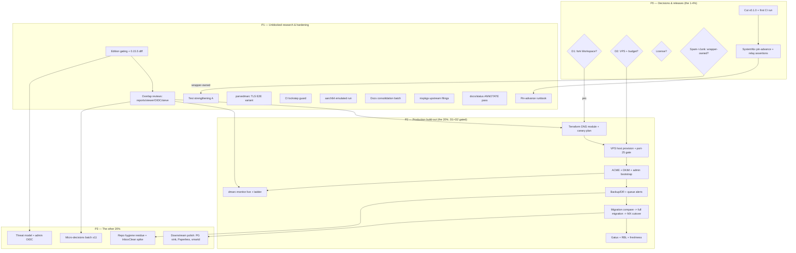

# nix-email Pareto Master Plan — 2026-09-15 19:23

> **Purpose:** rank ALL open work (TODO_LIST.md verified rows + ROADMAP.md
> themes + the 2026-09-15 capability-research session's 20 new candidates) by
> Pareto leverage, then split into executable tasks. Point-in-time snapshot —
> the living sources stay `TODO_LIST.md` / `ROADMAP.md`; HARVEST into them is
> deliberately deferred until approved (see §9).
>
> **Inputs consumed:** `TODO_LIST.md` (19:xx sweep, 19 rows), `ROADMAP.md`
> (5 themes, 6 open questions, 5 non-goals), `FEATURES.md`,
> `docs/status/2026-09-15_19-19_stalwart-capability-research-session.md`
> (f/1–f/20), README verified-facts ledger (via AGENTS.md pointers).
>
> **The result being maximized:** Lars sends and receives production email on
> his own stack (Stalwart inbound on Hetzner VPS, Resend outbound relay,
> parsedmarc DMARC monitoring) with repo-grade confidence — WITHOUT
> verschlimmbessern: no weakened tests, no inflated estimates, no fake
> progress on gated items, non-goals stay non-goals.

---

## 1. Pareto Breakdown

### The 1% that delivers 51%

**D1 — the Google Workspace fork decision** (user decision, minutes to make).

Everything material hangs off it: the VPS host, the Terraform DNS module,
mailbox migration, the live `dmarc@` mailbox (dmarc-monitor goes live), secret
rotation, migration tooling, Gatus external checks. Seven of TODO_LIST's 19
rows and ~60% of ROADMAP's themes are `BLOCKED (D1)`. No code task can
substitute for it; every code task behind it is inert until it lands.

### The 4% that delivers 64%

| Item | Why it compounds |
|------|------------------|
| **D2 — VPS placement/budget** (user) | D1-yes still needs a host; gates port-25 request, backup target choice |
| **Cut `v0.1.0`** (20 min, unblocked) | Closes release hygiene; gives CI its first real tagged run |
| **SystemNix pin-advance + relay assertions** (30 min, unblocked) | Restores the consumer contract test — real integration confidence |
| **Research: edition gating + 0.15.5 diff** (90 min, unblocked) | Prevents BUILDING things Stalwart 0.15.5 already ships, or that are Enterprise-gated — the #1 verschlimmbessern insurance for the gated 80% |
| **LICENSE final call** (5 min, user) | Removes the only "shipped but unconfirmed" artifact |

### The 20% that delivers 80%

The D1/D2-gated production core, in dependency order:

1. **Research closure** — overlap reviews (native report-ingestion vs
   parsedmarc; native DMARC viz vs viewer; OIDC; sieve-for-Junk) shrink the
   build-out before it starts
2. **Terraform `stalwart-mail` DNS module** + canary-domain-first rollout plan
3. **VPS host provisioning** — NixOS via domains-repo cloud-init, rDNS/PTR,
   firewall review, port-25/465 gate request
4. **Real TLS + DKIM + admin bootstrap** — ACME (DNS-01/HTTP-01), DKIM keygen
   → sops, declarative provisioning oneshot
5. **Backup/DR** — export timer, offsite pull, recovery key, monthly restore
   drill; queue-depth/age alerting
6. **dmarc-monitor live** on the real `dmarc@` mailbox; DMARC ladder begins
7. **Migration + MX cutover** — tooling compare first, full mailbox migration
   before the switch, Workspace alive ~2 weeks as rollback

Outcome: real mail flows on the own stack with rollback safety.

### The other 20% (to 100%)

Repo excellence (upstream nixpkgs filings, workaround-retirement watch,
threat model, aarch64 posture, test strengthening, docs consolidation),
monitoring polish (Gatus, RBL, freshness checks), downstream integrations
(Paperless off Gmail app passwords, smartd decoupling, InboxClean JMAP
spike), admin OIDC, micro-decisions (POP3, JMAP-WS, autoconfig, PROXY
protocol, DANE/MTA-STS, encryption-at-rest, TOTP), and possibly the DMARC
viewer — IF the native-viz review says Stalwart 0.15.5 Community doesn't
already cover it.

### Guard rails (anti-verschlimmbessern, from ROADMAP Non-goals + AGENTS.md)

- Mailcow/Mailu, Piler, Elasticsearch-for-parsedmarc, a mailpit wrapper,
  direct-to-MX outbound: **stay rejected** — any task that drifts toward them
  is a bug in this plan.
- Never weaken module defaults or test assertions to make a gate green;
  gate commands never wear pipes; E2E ordering rules (provision before
  probes) hold.
- Vendor-site claims (stalw.art) are UNVERIFIED until probed against the
  pinned 0.15.5 binary per the README ledger method — every wiring task below
  starts with a ledger-grade verification step.
- This plan does NOT mutate TODO_LIST/ROADMAP (snapshot only; harvest needs
  approval).

---

## 2. Execution graph (mermaid)

---

## 3. Level 1 — comprehensive plan (ALL todos, 5–100 min, sorted by importance/impact/effort/customer-value)

Impact: C=critical H=high M=medium L=low. Value = customer (Lars) value:
prod-mail, confidence, hygiene, enablement. Status: unblocked / user-gated /
D1D2-gated / auth-gated.

| # | Task | Phase | Impact | Effort | Value | Status | Source |
|---|------|-------|--------|--------|-------|--------|--------|
| L01 | D1: decide Workspace fork (user decision; enables 7 TODO rows + 3 ROADMAP themes) | P0 | C | 0min(user) | enablement | user-gated | ROADMAP Q1 |
| L02 | D2: VPS placement/budget/backup target (user) | P0 | C | 0min(user) | enablement | user-gated | ROADMAP Q2 |
| L03 | Cut v0.1.0: CHANGELOG dated section, tag, GitHub release, verify first real CI run | P0 | H | 20min | hygiene | unblocked | TODO High |
| L04 | SystemNix: advance nix-email pin, restore relay-credential assertions, delete option-existence guard | P0 | H | 30min | confidence | unblocked | TODO High |
| L05 | Research: fetch /compare as HTML (edition gating) + diff advertised features vs pinned 0.15.5 | P1 | H | 90min | enablement | unblocked | S1+S2 |
| L06 | Overlap design reviews: native DMARC/TLS-RPT/ARF viz vs parsedmarc+viewer; OIDC in 0.15.5; sieve-for-Junk feasibility | P1 | H | 90min | enablement | unblocked | S5+S6+S7+S8 |
| L07 | License: user names it; flip LICENSE file; note in README | P0 | M | 5min+5min | hygiene | user-gated | TODO Low / ROADMAP Q3 |
| L08 | Spam→Junk ownership call (recommendation on table: wrapper-owned sieve); user decides | P0 | H | 0min(user) | prod-mail | user-gated | ROADMAP Q6 |
| L09 | Pin-advance runbook doc (bump procedure + revert-condition checklist, both locks) | P1 | M | 30min | confidence | unblocked | TODO Med |
| L10 | Test strengthening A: parsedmarc CSV row-count; over-quota SECOND reschedule line; negative-cache cost doc | P1 | M | 60min | confidence | unblocked | TODO Low x3 |
| L11 | parsedmarc-e2e TLS-capable localMail variant (cert fixture) | P1 | M | 60min | confidence | unblocked | TODO Med |
| L12 | CI lockstep guard: expected-checks must fail when flake.nix declares a check CI doesn't list | P1 | M | 30min | hygiene | unblocked | TODO Low |
| L13 | aarch64: one emulated stalwart-e2e run; decide if it earns CI time | P1 | L | 30min | hygiene | unblocked | TODO Med |
| L14 | Docs consolidation: README runbook→SystemNix pointer; stateVersion note x3→1; pin-discipline note; VM debug script→tests/fixtures | P1 | L | 60min | hygiene | unblocked | TODO Low x4 |
| L15 | File the two diagnosed nixpkgs issues upstream (host-less [elasticsearch]; imapclient/py3.14) | P1 | M | 45min | hygiene | auth-gated | TODO Low |
| L16 | docs/status ANNOTATE pass (needs user to name files/time range) | P1 | L | 60min | hygiene | user-scoped | TODO Med |
| L17 | Terraform `stalwart-mail` DNS module (MX/SPF/DKIM/DMARC/MTA-STS/TLS-RPT) + canary-first rollout plan | P2 | C | 90min | prod-mail | D1D2-gated | ROADMAP T2 |
| L18 | VPS host: NixOS via domains-repo cloud-init, rDNS/PTR, firewall review, port-25/465 request, log/disk policy | P2 | C | 90min | prod-mail | D1D2-gated | ROADMAP T1 |
| L19 | Real TLS (ACME DNS-01/HTTP-01) + DKIM keygen→sops + admin bootstrap oneshot (POST /api/principal recipe) | P2 | C | 90min | prod-mail | D1D2-gated | ROADMAP T1 |
| L20 | Backup/DR: export timer + offsite pull + recovery key in sops group + FIRST restore drill; queue-depth/age alerts off Prometheus | P2 | H | 90min | prod-mail | D1D2-gated | ROADMAP T1 |
| L21 | dmarc-monitor live on real `dmarc@` mailbox; first poll lands JSON/CSV; DMARC ladder none→quarantine begins | P2 | H | 60min | prod-mail | D1-gated | TODO High / ROADMAP T4 |
| L22 | Migration: tooling compare (vandelay vs imapsync) on scratch, then full migration, then MX cutover with 2-week rollback window + post-cutover checks | P2 | C | 60min+90min | prod-mail | D1-gated | TODO Med / ROADMAP T3 |
| L23 | Gatus external checks (starttls :25, tls :993, cert expiry) + RBL monitor for VPS IP + aggregate.json freshness (dedup vs backup.maxAgeHours) | P2 | M | 60min | confidence | D1D2-gated | ROADMAP T4 |
| L24 | Downstream polish: parsedmarc PG sink experiment; Paperless off Gmail app passwords; smartd alert path decoupled from mail relay | P3 | M | 90min | prod-mail | post-migration | ROADMAP T4 |
| L25 | Threat-model doc + Stalwart OIDC (Pocket ID) admin login — only if L06 verifies 0.15.5 support | P3 | M | 90min | hygiene | after L06 | ROADMAP T5 |
| L26 | Micro-decisions batch (each: verify in 0.15.5 → decide wrapper option / non-goal note): autoconfig, PROXY protocol, DANE/MTA-STS inbound, encryption-at-rest, TOTP/app-pw, vandelay scope, FTS non-goal line, POP3, JMAP-WS, wrapper doctrine (feeds ROADMAP Q5), DNS-truth split-brain guard note | P3 | L | 90min | hygiene | unblocked | S9-S19 |
| L27 | Repo hygiene residue: workaround-retirement re-check procedure on bumps; Resend keep-or-retire doc post-cutover; InboxClean JMAP spike scoping | P3 | L | 60min | hygiene | post-migration | ROADMAP T5 |

Totals: 27 tasks, ~19h10m executable effort + 4 user decisions. ALL TODO_LIST
rows (19), ALL ROADMAP raw ideas (mapped into L17-L27), ALL session f/1-f/20
(mapped: S1-S2→L05, S3→wiring tasks' step 1, S4→this doc, S5-S8→L06,
S9-S19→L26, S20→personal process, not repo work).

---

## 4. Level 2 — micro-breakdown (each ≤12 min, sorted by importance within phase)

### P0 — Decisions & releases

| ID | Micro-task | ≤12min | Depends |
|----|-----------|--------|---------|
| 01a | D1 decision recorded (user) — update ROADMAP open-questions + TODO unblock sweep | 5 | — |
| 01b | D2 decision recorded (user) — same | 5 | — |
| 03a | Verify CHANGELOG [Unreleased]+[0.1.0] contents match git log since 0.1.0 scope | 5 | — |
| 03b | Move [Unreleased] into dated 0.1.0 section | 5 | 03a |
| 03c | `git tag v0.1.0` (annotated) | 2 | 03b |
| 03d | `gh release create v0.1.0` with notes from CHANGELOG | 10 | 03c |
| 03e | Watch the CI run on the tag; assert all 4 checks green, fail-closed | 10 | 03d |
| 04a | SystemNix: bump nix-email input rev past relay-landing rev | 5 | — |
| 04b | Restore relay-credential assertions in tests/test-nix-email.nix | 10 | 04a |
| 04c | Delete the wrapper option-existence guard | 5 | 04b |
| 04d | `nix flake check` in SystemNix; both repos green | 10 | 04c |
| 07a | User names license; flip LICENSE file + README note | 5+5 | 01a* |
| 08a | Spam→Junk call recorded; if wrapper-owned: write the declarative sieve task spec (test contract: GTUBE subtest asserts real Junk filing) | 10 | L06 sieve check |

### P1 — Unblocked research & hardening

| ID | Micro-task | ≤12min | Depends |
|----|-----------|--------|---------|
| 05a | `fetch` stalw.art/compare as HTML; extract per-feature Community/Enterprise marks for the 9 candidate features | 10 | — |
| 05b | Pull Stalwart GitHub release notes 0.15.5→current; list features added after 0.15.5 | 10 | — |
| 05c | Cross-table: candidate features × (edition? in-0.15.5?) → verdict per feature | 10 | 05a,05b |
| 05d | Write findings into README ledger ONLY for facts verified against the pinned binary; rest stays in this doc | 10 | 05c |
| 06a | Review: native DMARC/TLS-RPT/ARF ingestion+viz vs parsedmarc module — verdict: replace / complement / keep-both | 12 | 05c |
| 06b | Review: native report viz vs ROADMAP tiny viewer — verdict per 0.15.5 Community | 10 | 05c |
| 06c | Verify OIDC config keys in pinned 0.15.5 (local binary probe or 0.15.5-tag docs) | 12 | 05b |
| 06d | Verify Sieve spam-tag→fileinto-Junk path in 0.15.5 (X-Spam-Status header exists per ledger) | 12 | 05b |
| 06e | Write L06 verdicts as ROADMAP deltas proposal (not applied — harvest-gated) | 10 | 06a-06d |
| 09a | Draft pin-advance runbook: both-locks-together bump procedure | 10 | 04d |
| 09b | Add revert-condition checklist (imapclient>=4.x; [elasticsearch] emission re-check) | 10 | 09a |
| 09c | Cross-link from README ledger + module comments to the runbook | 5 | 09b |
| 10a | parsedmarc-e2e: replace `test -s` CSV check with row-count assertion | 10 | — |
| 10b | stalwart-e2e: assert SECOND `Message rescheduled` line after sleep | 10 | — |
| 10c | stalwart-e2e: document ~65s negative-cache cost (resolver-timeout breakdown) | 10 | — |
| 10d | Run full `nix flake check`; all green, no pipes | 10 | 10a-10c |
| 11a | Create cert fixture for localMail; enable ssl variant in test fixture | 12 | — |
| 11b | Handle mailsuite auto-STARTTLS: force the TLS path (disable advertised upgrade) | 12 | 11a |
| 11c | Assert TLS IMAP path green in parsedmarc-e2e; full check green | 10 | 11b |
| 12a | Extract declared checks from flake.nix programmatically; CI expected-list compares | 10 | — |
| 12b | Negative test: add fake check name, assert CI fails; remove | 10 | 12a |
| 13a | Run stalwart-e2e once under qemu-aarch64; record runtime | 12 | — |
| 13b | Decide: CI-worthy or documented-manual; note in flake trap comment | 5 | 13a |
| 14a | README runbook: point parsedmarc enablement at SystemNix wrapper | 10 | — |
| 14b | Consolidate stateVersion unit-name coupling to ONE canonical note | 10 | — |
| 14c | Pin-discipline note: hard rev vs ?ref=master rationale | 5 | — |
| 14d | Preserve VM debug script as tests/fixtures/debug-template (wait_for_open_port pattern) | 10 | — |
| 15a | Re-verify both diagnoses vs current nixpkgs master (per TODO evidence) | 12 | — |
| 15b | Draft issue (a) host-less [elasticsearch] with minimal repro | 12 | 15a |
| 15c | Draft issue (b) imapclient/py3.14 STARTTLS with repro | 12 | 15a |
| 15d | File both; link from README ledger workaround entries | 5 | 15b,15c,auth |
| 16a | User names docs/status files/time range; ANNOTATE resolved items inline `~~item~~ done at <hash>` | 12×N | user |

### P2 — Production build-out (D1+D2)

| ID | Micro-task | ≤12min | Depends |
|----|-----------|--------|---------|
| 17a | Terraform module skeleton in domains repo: variables, stalwart-mail resource set | 12 | 01a |
| 17b | MX + SPF (`v=spf1 mx -all`) + DKIM TXT resources | 12 | 17a |
| 17c | DMARC (rua→dmarc@) + MTA-STS + _smtp._tls TLS-RPT resources | 12 | 17b |
| 17d | Canary-domain-first rollout plan: TTL lowering, dual-MX window, rollback steps | 12 | 17c |
| 18a | NixOS VPS config via domains-repo cloud-init path; consumer wrapper over this flake | 12 | 01a,01b |
| 18b | rDNS/PTR via Hetzner API (or documented manual step) | 10 | 18a |
| 18c | Firewall review (25/465/587/993 only, admin stays loopback+tunnel) | 10 | 18a |
| 18d | Submit Hetzner port-25/465 limit request (after 1-month+invoice gate clears) | 5 | 18a |
| 18e | Log retention + disk/quota policy in consumer layer | 10 | 18a |
| 19a | ACME tier switch: DNS-01 or HTTP-01 decision + config; verify issuance on live host | 12 | 18c |
| 19b | DKIM keygen via POST /api/dkim; keys into sops; selector rotation note | 12 | 19a |
| 19c | Admin bootstrap oneshot: verified principal-creation recipe → systemd unit (roles:["user"]!) | 12 | 19a |
| 19d | Provision-domain/accounts BEFORE any SMTP probe (negative-cache rule) | 5 | 19c |
| 20a | `stalwart --export` systemd timer + offsite pull target (D2 choice) | 12 | 19a |
| 20b | Recovery age key into sops key group | 10 | 20a |
| 20c | FIRST restore drill (wipe→import→message survives); calendar monthly drill | 12 | 20b |
| 20d | Queue-depth/queue-age alert rules off /metrics/prometheus | 12 | 19a |
| 21a | Point dmarc-monitor at real dmarc@ mailbox via SystemNix sops secret | 10 | 01a |
| 21b | First live poll: JSON/CSV lands; assert output non-empty + structured | 10 | 21a |
| 21c | DMARC ladder step 1: policy=none with rua verified flowing | 10 | 21b |
| 21d | Gatus freshness check over aggregate.json (dedup vs backup.maxAgeHours first) | 10 | 21b |
| 22a | Migration tooling compare: vandelay vs imapsync on two scratch mailboxes | 12 | 01a |
| 22b | Record R6 verdict + full-migration runbook (pre-MX, per-account parity list) | 12 | 22a |
| 22c | Execute full mailbox migration; Workspace kept alive as rollback | 12×N | 22b |
| 22d | MX cutover on canary domain first; then the rest | 12 | 22c |
| 22e | Post-cutover checks: SPF/DKIM/DMARC alignment, mail-tester, per-account parity | 12 | 22d |
| 23a | Gatus external checks: starttls :25, tls :993, cert expiry | 12 | 18c |
| 23b | RBL monitor for the VPS IP | 10 | 18a |
| 23c | Wire alerts to non-mail path (circular-dependency guard) | 10 | 23a |

### P3 — The other 20%

| ID | Micro-task | ≤12min | Depends |
|----|-----------|--------|---------|
| 24a | parsedmarc psycopg/PG sink experiment behind a flag; revert if it fights the zero-dep doctrine | 12 | 21b |
| 24b | Paperless accounts off Gmail app passwords onto own IMAP | 12 | 22e |
| 24c | smartd remote-alert path decoupled from mail relay | 10 | 22e |
| 24d | InboxClean JMAP/IMAP spike scoping note | 10 | 22e |
| 25a | Threat-model doc draft (assets, trust boundaries, the ledger's known traps) | 12×2 | — |
| 25b | OIDC (Pocket ID) admin login — only if 06c verified; wire + test | 12×3 | 06c |
| 26a | Micro-verification probes batch 1: autoconfig, PROXY protocol, DANE/MTA-STS knobs (0.15.5 binary/docs) | 12×3 | 05b |
| 26b | Micro-verification probes batch 2: encryption-at-rest, TOTP/app-pw, vandelay scope | 12×3 | 05b |
| 26c | Decisions: POP3 enable/non-goal; JMAP-WS survey; FTS non-goal line | 12 | 26a |
| 26d | Wrapper doctrine note: which features get options vs settings pass-through (feeds ROADMAP Q5) | 12 | L06 |
| 26e | DNS-truth split-brain guard note: Stalwart automated-DNS vs Terraform ownership | 10 | 26a |
| 27a | Workaround-retirement re-check procedure (on every nixpkgs bump; conditions already in module comments) | 10 | — |
| 27b | Resend keep-or-retire decision doc (post-cutover data) | 12 | 22e |
| 27c | Rotate the 3 SystemNix placeholder secrets + sops-key-audit confirms rotation-due | 10 | 01a |

Totals: ~100 micro-tasks; every L1 task decomposed; nothing dropped.

---

## 5. Verification rules (per phase)

- **P0:** CI green on tag + SystemNix check green (04d) — no pipes on gates.
- **P1:** `nix flake check` full green after every batch (10d, 11c); negative
  test proves the lockstep guard actually bites (12b).
- **P2:** live-host evidence only — IMAPS fetch of a real message, DKIM
  `d=` verified by external validator, restore drill passes, DMARC rua
  flowing, parity list per account. Never trust a green eval for runtime
  claims (README ledger doctrine).
- **P3:** docs get reviewers'-eye freshness check; experiments revert unless
  they beat the zero-dependency doctrine.

## 6. Sorted summary (importance → effort)

1. L01/L02/L08/L07 (user decisions — zero code, unlock/shape everything)
2. L03, L04 (unblocked release + consumer confidence)
3. L05, L06 (research that shrinks P2 — do BEFORE building)
4. L17→L18→L19→L20→L22 (production spine), L21 in parallel after L19
5. L23, L24 (monitoring + downstream)
6. L09-L16 (hardening/hygiene — filler between gated stages)
7. L25-L27 (polish)

## 7. What deliberately has NO task (non-goals restated)

Mailcow/Mailu, Piler, Elasticsearch/OpenSearch for parsedmarc, a mailpit
wrapper, direct-to-MX outbound, weakened tests, priority-inflation of
mkDefault firewall list (README root-cause stands), and any wiring of a
vendor-claimed feature without a pinned-binary verification step first.

## 8. Answers this plan gives to the status report's open questions

- **Q1 (home for unverified findings):** this planning doc + future
  `docs/planning/` notes; README ledger only after pinned-binary verification
  (05d enforces the boundary).
- **Q2 (research now vs park):** research FIRST (L05/L06 are unblocked and
  shrink the gated themes) — but execution of P2 stays parked on D1/D2.
- **Q3 (verification bar):** two-tier, codified in §5: exploratory Q&A may
  cite the vendor with caveats; anything approaching wiring requires
  ledger-grade verification.

## 9. Harvest note

This snapshot deliberately does not edit TODO_LIST.md/ROADMAP.md. New
candidates introduced here (S-series → L05/L06/L26, plus verdict outputs of
06e) should be HARVESTed into the living docs after user approval — say the
word and docs-health HARVEST runs against this file.
