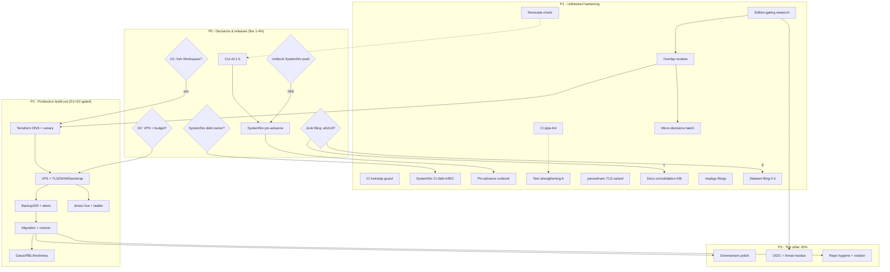

# nix-email Pareto Execution Plan v2 — 2026-09-15 19:58 (current state)

> **Purpose:** rank ALL open work by Pareto leverage and split it into
> executable tasks. This SUPERSEDES `2026-09-15_19-23_nix-email-pareto-master-plan.md`
> (same structure, corrected facts). Point-in-time snapshot: living sources stay
> `TODO_LIST.md` / `ROADMAP.md`.
>
> **What moved since the 19:23 master plan (why v2 exists):**
> 1. **LICENSE RESOLVED** — user confirmed MIT (19:2x); master-plan L07 is done.
> 2. **Sieve-for-Junk feasibility RESOLVED** (master-plan 06d): source-verified
>    that settings-defined sieve CANNOT `fileinto` in 0.15.5 (trusted runtime
>    drops FileInto; delivery runs only the per-account active script from the
>    store; no OSS API to set it) — README ledgered. The product decision is
>    re-posed with NEW options (ROADMAP Q6: a JMAP-automation / b webmail /
>    c tag-only / d upstream request; recommendation c+d).
> 3. **SystemNix local-path pins:** branching-flow + go-cqrs-lite FIXED
>    (git+ssh, narHash unchanged; go-cqrs-lite fix pushed as branch
>    `cqrs-lint-vendorhash-fix`) — but the SystemNix push is BLOCKED by GitHub
>    push protection on a parallel session's commit (`63fd5a83`, one fixture
>    literal). Remaining SystemNix CI debt inventoried: statix ~20 findings,
>    secret-scan `syn_` policy, 2 flippable pins, 1 unpushed-worktree pin,
>    gitleaks-hook false-positives on `rev=`.
> 4. **Pipe-to-file assertion class:** CI caught `curl | grep -q` failing with
>    exit 23 on a MATCHING payload (pipefail + EPIPE); all 10 piped in-VM
>    assertions converted to dump-and-grep; doctrine in AGENTS/CONTRIBUTING;
>    a mechanical CI lint is a NEW task.
> 5. CI is green on GitHub (first ever), nix-email pushed through `7866f13`,
>    a parallel session is ACTIVE in both repos — ownership split is a
>    coordination task, not an assumption.
>
> **The result being maximized:** Lars sends and receives production email on
> his own stack with repo-grade confidence — WITHOUT verschlimmbessern (no
> weakened tests, no inflated estimates, non-goals stay non-goals).

---

## 1. Pareto Breakdown

### The 1% that delivers 51%

**D1 — the Google Workspace fork decision** (user, minutes). Unchanged: 7+
TODO rows and ~60% of ROADMAP themes sit behind it. Nothing code-side
substitutes.

### The 4% that delivers 64%

| Item | Why it compounds |
|------|------------------|
| **D2 — VPS placement/budget** (user) | D1-yes still needs a host; gates port-25 request + backup target |
| **SystemNix push unblock** (user: one click "used in tests") | 7 commits sit locally; CI debt work is invisible until pushed |
| **Cut `v0.1.0`** (20 min, unblocked) | Release hygiene; first tagged CI run |
| **SystemNix pin-advance + relay assertions** (30 min, unblocked) | Restores the consumer contract test |
| **Junk-filing call** (user, revised options a-d) | Decides the spam product story + possibly an upstream filing |

### The 20% that delivers 80%

Unchanged in structure from the master plan (D1/D2-gated production core):
research closure (edition gating + overlap reviews, now MINUS the resolved
sieve question) → Terraform DNS → VPS + TLS/DKIM/bootstrap → backup/DR →
dmarc-monitor live + ladder → migration + cutover. PLUS the newly visible
**SystemNix CI-debt block** (it gates consumer confidence for everything
above).

### The other 20% (to 100%)

Repo excellence (pipe-lint CI guard, lockstep guard, upstream filings,
workaround-retirement watch, aarch64, docs consolidation, ANNOTATE pass),
monitoring polish (Gatus/RBL/freshness), downstream integrations, admin OIDC,
micro-decisions batch, Renovate activation check.

### Guard rails (unchanged)

- Mailcow/Mailu, Piler, Elasticsearch-for-parsedmarc, mailpit wrapper,
  direct-to-MX: **stay rejected**.
- Never weaken module defaults or assertions to go green; gates never wear
  pipes; in-VM assertions are file-based; transcripts before assertions.
- Vendor claims stay UNVERIFIED until probed against the pinned 0.15.5 binary.
- This snapshot does not mutate TODO_LIST/ROADMAP (harvest on approval).

---

## 2. Level 1 — comprehensive plan (ALL todos; sorted by importance/impact/effort/customer-value)

Impact C/H/M/L. U=unblocked, USER=user decision, D12=D1/D2-gated, AUTH=filing
authorization, PS=parallel-session coordination.

| # | Task | Phase | Impact | Effort | Value | Status | Source |
|---|------|-------|--------|--------|-------|--------|--------|
| 01 | D1: Workspace fork decision; record in ROADMAP/TODO | P0 | C | user | enablement | USER | ROADMAP Q1 |
| 02 | D2: VPS placement/budget/backup target | P0 | C | user | enablement | USER | ROADMAP Q2 |
| 03 | SystemNix push unblock (click "used in tests") + push the 7 local commits | P0 | H | 10min | confidence | USER+U | 19:52 report §g-2 |
| 04 | Cut v0.1.0: dated CHANGELOG section, annotated tag, GitHub release, watch first tagged CI run | P0 | H | 20min | hygiene | U | TODO High |
| 05 | SystemNix pin-advance: bump rev past relay-landing, restore relay-credential assertions, delete wrapper guard, gate both repos | P0 | H | 30min | confidence | U (after 03) | TODO High |
| 06 | Junk-filing call on REVISED options (a JMAP-automation / b webmail / c tag-only / d upstream request; rec c+d); record verdict in ROADMAP Q6 | P0 | H | user | prod-mail | USER | ROADMAP Q6 + ledger |
| 07 | SystemNix CI-debt ownership split with the parallel session (who takes statix/secret-scan/pins) | P0 | M | 10min | coordination | PS | 19:52 §e-4 |
| 08 | CI pipe-lint: fail CI on `\| grep -q` inside tests/*.nix testScripts (mechanize the exit-23 lesson) | P1 | M | 20min | confidence | U | 19:52 §f-4 |
| 09 | Renovate activation check: did the app pick up the now-pushed repo; renovate.json approval gate works | P1 | L | 10min | hygiene | U | 19:19 §f-6 |
| 10 | Pin-advance runbook doc (procedure + revert-condition checklist incl. imapclient>=4.x watch) | P1 | M | 30min | confidence | U | TODO Med |
| 11 | Test strengthening A: CSV row-count; SECOND reschedule line; negative-cache 65s cost proof | P1 | M | 45min | confidence | U | TODO Low ×3 |
| 12 | parsedmarc-e2e TLS localMail variant (cert fixture; mailsuite STARTTLS interplay) | P1 | M | 60min | confidence | U | TODO Med |
| 13 | CI lockstep guard (flake-declared checks vs CI expected-list; negative test) | P1 | M | 30min | hygiene | U | TODO Low |
| 14 | aarch64: one emulated stalwart-e2e run; CI-worthy or documented-manual verdict | P1 | L | 30min | hygiene | U | TODO Med |
| 15 | Docs consolidation A: README runbook→SystemNix pointer; stateVersion note ×3→1; pin-discipline note | P1 | L | 45min | hygiene | U | TODO Low ×3 |
| 16 | Docs consolidation B: VM debug script → tests/fixtures template; docs/status ANNOTATE pass (user-scoped) | P1 | L | 60min | hygiene | U+USER | TODO Low+Med |
| 17 | Upstream nixpkgs filings ×2 (diagnoses verified vs master; drafts mechanical) | P1 | M | 45min | hygiene | AUTH | TODO Low |
| 18 | Stalwart upstream request: declarative server-side Junk filing (the ledger entry is the evidence) — only if 06 = d | P1 | M | 30min | hygiene | after 06 | ROADMAP Q6d |
| 19 | Edition-gating research: stalw.art compare + release-notes diff vs pinned 0.15.5 | P1 | H | 90min | enablement | U | master L05 |
| 20 | Overlap reviews minus sieve: native report viz vs viewer; OIDC in 0.15.5 (sieve DONE — ledgered) | P1 | H | 75min | enablement | U | master L06 minus 06d |
| 21 | Micro-decisions batch: autoconfig, PROXY, DANE/MTA-STS, encryption-at-rest, TOTP, POP3, JMAP-WS, FTS, wrapper doctrine, DNS-truth guard, README ops-detail level (Q4) | P1 | L | 90min | hygiene | U | master L26 + Q4 |
| 22 | SystemNix CI debt A: flip file-and-image-renamer + BuildFlow pins (revs already on GitHub); push go-nix-helpers-vnfix worktree branch + flip | P1 | H | 35min | confidence | U (after 03/07) | 19:52 §b-3 |
| 23 | SystemNix CI debt B: gitleaks allowlist for `rev=<40hex>` so the pre-commit hook works for humans again | P1 | M | 20min | hygiene | U | 19:52 §b-3 |
| 24 | SystemNix CI debt C: statix sweep (~20 findings) + secret-scan `syn_` allowlist policy (user) + Go-deps-audit triage | P1 | M | 90min+user | hygiene | U+USER (after 07) | 19:52 §b-3 |
| 25 | Terraform `stalwart-mail` DNS module + canary-first rollout plan | P2 | C | 90min | prod-mail | D12 | master L17 |
| 26 | VPS build-out: host provision, port-25 gate, ACME TLS, DKIM→sops, admin bootstrap oneshot, backup/DR + first restore drill, queue alerts | P2 | C | 90min×3 | prod-mail | D12 | master L18-L20 |
| 27 | Go-live: dmarc-monitor live + DMARC ladder; migration compare → full migration → MX cutover; Gatus/RBL/freshness; post-cutover parity | P2 | C | 90min×2 | prod-mail | D1 | master L21-L23 |
| — | P3 residue (unchanged from master plan): downstream polish (PG sink, Paperless, smartd, InboxClean spike), OIDC admin (if 20 verifies), repo-hygiene residue, secret rotation (D1), threat-model upkeep | P3 | M/L | 60-90min | hygiene | D12/post-cutover | master L24-L27 |

Totals: 27 numbered tasks (P3 consolidated into one row here; fully exploded
in the master plan and §3 below). ALL current TODO_LIST rows (18), ALL ROADMAP
open questions (Q1→01, Q2→02, Q3 RESOLVED, Q4→21, Q5→21, Q6→06), all 19:52
report items, and the master plan's still-open L-tasks are covered.

---

## 3. Level 2 — micro-breakdown (each ≤12 min; sorted by importance within phase)

### P0 — Decisions & releases

| ID | Micro-task | ≤12min | Depends |
|----|-----------|--------|---------|
| 01a | D1 decision recorded (user); ROADMAP + TODO unblock sweep | 5 | — |
| 02a | D2 decision recorded (user); same | 5 | — |
| 03a | User clicks GH013 unblock URL ("used in tests"); parallel session informed | 2 | — |
| 03b | Push SystemNix master (7 commits); watch the three workflows start | 5 | 03a |
| 03c | Triage Go-deps-audit + Secret-scan runs on the pushed tree | 10 | 03b |
| 04a | Verify CHANGELOG [Unreleased]/[0.1.0] split matches reality | 5 | — |
| 04b | Move [Unreleased] into dated section; fix links | 5 | 04a |
| 04c | `git tag -a v0.1.0`; `gh release create` with notes | 10 | 04b |
| 04d | Watch CI on the tag; all 4 checks green, fail-closed | 10 | 04c |
| 05a | SystemNix: bump nix-email input rev past relay-landing rev; lock | 5 | 03b |
| 05b | Restore relay-credential assertions (replace tryEval absence-proof) | 10 | 05a |
| 05c | Delete wrapper option-existence guard; `nix flake check` both repos | 10 | 05b |
| 06a | Junk-filing verdict recorded in ROADMAP Q6; if (c): ledger "tag-only is the end state" note | 10 | — |
| 06b | If (d): draft Stalwart upstream request from the ledger entry (feeds 18) | 10 | 06a |
| 07a | Ask/decide ownership split with the parallel session; write it into both AGENTS.md files | 10 | — |

### P1 — Unblocked research & hardening

| ID | Micro-task | ≤12min | Depends |
|----|-----------|--------|---------|
| 08a | CI step: grep testScripts for `\| grep -q` (allow known-safe list); fails closed | 10 | — |
| 08b | Negative test: temporarily add a piped assertion, assert CI fails; revert | 10 | 08a |
| 09a | Check Renovate dashboard/PRs on nix-email; verify approval gating | 10 | — |
| 10a | Draft runbook: both-locks-together bump procedure | 10 | 05c |
| 10b | Revert-condition checklist (imapclient>=4.x; [elasticsearch] re-check per bump) | 10 | 10a |
| 10c | Cross-link ledger + module comments + SystemNix PIN NOTE to the runbook | 5 | 10b |
| 11a | parsedmarc-e2e CSV row-count assertion (replace `test -s`) | 10 | — |
| 11b | stalwart-e2e: SECOND `Message rescheduled` line after sleep | 10 | — |
| 11c | negative-cache 65s cost breakdown note (resolver timeouts) | 10 | — |
| 11d | Full `nix flake check` green after 11a-11c | 10 | 11a-c |
| 12a | Cert fixture for localMail; enable ssl variant | 12 | — |
| 12b | Force TLS path (mailsuite auto-STARTTLS interplay) | 12 | 12a |
| 12c | TLS variant green in full check | 10 | 12b |
| 13a | Extract declared checks from flake.nix; compare vs CI list, fail-closed | 10 | — |
| 13b | Negative test: fake check name → CI fails; revert | 10 | 13a |
| 14a | qemu-aarch64 run of stalwart-e2e; record runtime | 12 | — |
| 14b | Verdict: CI-worthy or documented-manual; update flake trap comment | 5 | 14a |
| 15a | README runbook → SystemNix wrapper pointer | 10 | — |
| 15b | stateVersion coupling → ONE canonical note (delete the other two) | 10 | — |
| 15c | Pin-discipline note (hard rev vs ?ref=master) | 5 | — |
| 16a | VM debug script → tests/fixtures/debug-template.py | 10 | — |
| 16b | ANNOTATE pass scope confirmed (user names files/range) | user | — |
| 16c | ANNOTATE resolved items inline (~~item~~ done at hash) across scoped files | 12×N | 16b |
| 17a | Re-verify both nixpkgs diagnoses vs master (evidence already current) | 5 | — |
| 17b | Draft issue (a) host-less [elasticsearch] with repro | 12 | 17a |
| 17c | Draft issue (b) imapclient/py3.14 incl. 4.0.1 starttls() gap | 12 | 17a |
| 17d | File both on authorization; link from ledger entries | 5 | 17b,c+AUTH |
| 18a | Draft Stalwart feature request (declarative server-side filing) with source cites | 12 | 06b |
| 19a | fetch stalw.art/compare; extract Community/Enterprise marks for candidates | 10 | — |
| 19b | Release notes 0.15.5→current; list post-0.15.5 features | 10 | — |
| 19c | Cross-table verdict per candidate feature | 10 | 19a,b |
| 19d | Ledger ONLY pinned-binary-verified facts; rest stays here | 10 | 19c |
| 20a | Native report viz vs tiny viewer verdict (0.15.5 Community) | 12 | 19c |
| 20b | OIDC config keys verified in pinned 0.15.5 | 12 | 19c |
| 20c | Write verdicts as ROADMAP deltas (harvest-gated) | 10 | 20a,b |
| 21a | Probes batch 1: autoconfig, PROXY protocol, DANE/MTA-STS | 12×3 | 19b |
| 21b | Probes batch 2: encryption-at-rest, TOTP/app-pw, vandelay scope | 12×3 | 19b |
| 21c | Decisions: POP3, JMAP-WS, FTS non-goal line, README ops-detail (Q4) | 12 | 21a |
| 21d | Wrapper doctrine note (options vs pass-through; feeds Q5) | 12 | 20c |
| 21e | DNS-truth split-brain guard note (Stalwart auto-DNS vs Terraform) | 10 | 21a |
| 22a | Flip file-and-image-renamer pin (rev already on GitHub); lock | 10 | 03b |
| 22b | Flip BuildFlow pin (rev already on GitHub); lock | 10 | 03b |
| 22c | Push go-nix-helpers-vnfix worktree rev as branch; flip pin; lock | 12 | 03b |
| 22d | `nix flake show` + local gate on the three flips | 10 | 22a-c |
| 23a | gitleaks.toml allowlist for `rev=[0-9a-f]{40}` in flake inputs | 10 | — |
| 23b | Verify pre-commit hook passes for a human commit again | 10 | 23a |
| 24a | statix sweep file 1-5 (inherit/paren findings, mechanical) | 12 | 07a |
| 24b | statix sweep file 6-10 | 12 | 24a |
| 24c | statix sweep file 11-rest; `statix check .` exit 0 | 12 | 24b |
| 24d | secret-scan `syn_` allowlist policy (user); apply config or purge decision | 10+user | 07a |
| 24e | SystemNix CI green run end-to-end; celebrate briefly | 10 | 22,23,24 |

### P2 — Production build-out (D1+D2 gated; micro-breakdown unchanged from the master plan §4 P2 — 17a-23c, 29 micro-tasks: Terraform skeleton→records→canary plan; VPS cloud-init→rDNS→firewall→port-25→policy; ACME→DKIM→bootstrap→provision-before-probe; export timer→recovery key→restore drill→queue alerts; dmarc mailbox→first poll→ladder→freshness; migration compare→runbook→migration→cutover→post-checks; Gatus→RBL→alert-path)

### P3 — The other 20% (micro-breakdown unchanged from master plan §4 P3 — 24a-27c, 12 micro-tasks: PG sink, Paperless, smartd, InboxClean scoping, threat-model upkeep, OIDC-if-verified, probe batches feed 21, workaround-recheck procedure, Resend keep-or-retire, secret rotation)

Totals: 47 P0/P1 micro-tasks + 29 P2 + 12 P3 ≈ 88 micro-tasks; every L1 task
decomposed; nothing dropped.

---

## 4. Execution graph (mermaid)

---

## 5. Verification rules (per phase)

- **P0:** CI green on the v0.1.0 tag; SystemNix flake-check green after the
  pin-advance; no pipes on any gate; the GH013 unblock explicitly acknowledged.
- **P1:** full `nix flake check` after every code batch (11d, 12c, 22d);
  negative tests prove the new CI guards bite (08b, 13b); statix exit 0 (24c);
  the gitleaks hook passes a real commit (23b).
- **P2:** live-host evidence only (IMAPS fetch of a real message, DKIM `d=`
  externally verified, restore drill passes, rua flowing, per-account parity).
- **P3:** experiments revert unless they beat the zero-dependency doctrine;
  docs get a freshness check.

## 6. Anti-verschlimmbessern guardrails

- Every P1 code task ships with its gate run; no assertion is weakened to
  pass; no from-memory identifiers or expected-output assertions.
- Parallel-session coordination (07a) BEFORE touching SystemNix CI debt —
  the 18:47 flake.nix edit and the 63fd5a83 commit prove we are two writers.
- This plan does not mutate TODO_LIST/ROADMAP; harvest needs approval.

---

*Format note: `.md` with an embedded mermaid graph per the explicit instruction
- overrides the pareto-planning skill's HTML default; not propagated into the
skill.*
