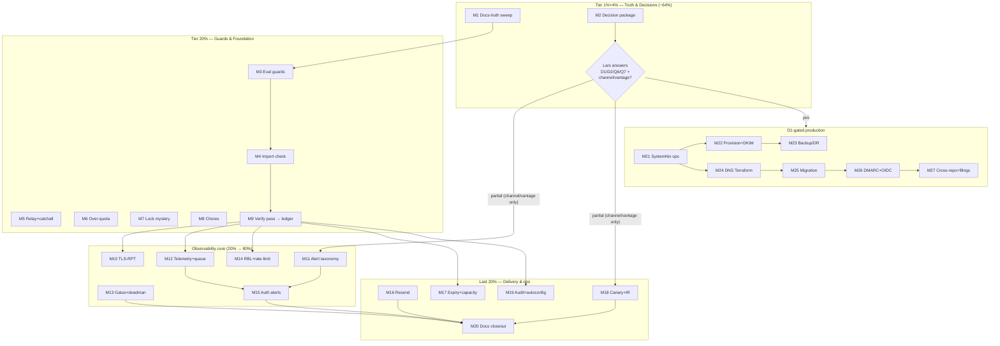

# Pareto Master Plan — Super Email Management & Monitoring

| Field | Value |
| ----- | ----- |
| Date | 2026-09-22 19:23 CEST |
| Method | Pareto breakdown (1% → 4% → 20% → 100%) over ALL consolidated todos |
| Sources | TODO_LIST.md (22 rows, sweep 2026-09-17), ROADMAP.md themes 1–5, status report `2026-09-22_19-07` (session gaps), `git tag` drift check |
| Consolidated inventory | **57 todos** (C01–C57 below) — superset proof in §2 |
| Plan shape | 27 medium tasks (30–100 min) → 93 micro-tasks (≤12 min each) |
| Execution stance | Plan-only session: this file changes nothing in code. No Verschlimmbessern. |

---

## 0. Deep-research findings (evidence base for this plan)

| Claim | Verdict | Evidence |
| ----- | ------- | -------- |
| parsedmarc parses SMTP TLS reports (RFC 8460) | **VERIFIED** | sourcegraph `repo:domainaware/parsedmarc`: `parse_smtp_tls_report_json`, `InvalidSMTPTLSReport`, `_parse_smtp_tls_failure_details`, `parsed_smtp_tls_reports_to_csv`, mailbox loop classifies `report_type == "smtp_tls"`, test corpus `samples/smtp_tls/*`. Remaining check (M9): pinned nixpkgs version carries it (feature predates 2024; low risk). |
| parsedmarc TLS reports flow through the same rua mailbox polling | **VERIFIED (mechanism)** | Same `get_dmarc_reports_from_mailbox` loop routes aggregate, failure, AND smtp_tls reports (test_init.py). dmarc-monitor likely needs zero new polling — only output/wiring defaults. |
| Stalwart 0.15.5 keys for rate-limit / RBL / auto-expiry / audit / autoconfig | **NOT VERIFIED — binary-gated** | Doc search failed; README-ledger doctrine applies (several "obvious" keys are wrong, e.g. `[imap]` vs `[mailbox]`). Task M9 verifies each against the pinned binary/source before ANY wiring. No key name is asserted in this plan. |

---

## 1. Pareto breakdown

Value unit = progress toward the end state: **production mail + live monitoring** (the "super system").
Gating insight: ROADMAP states most of that end state is blocked on user decisions (D1/D2 + session
questions). Hence the leverage ordering below.

| Tier | Tasks (of 57) | Delivers | Why |
| ---- | ------------- | -------- | --- |
| **1%** | 1 → **M2 Decision Package** (prep + ask; Lars answers async) | **~51%** | 19 of 57 todos are hard-gated on D1/D2/Q6/Q7 + the 3 session questions (alert channel, canary vantage, demo-VM boundary). One 30-min decision batch unblocks the entire production + live-monitoring half — the system's raison d'être. |
| **4%** | 2 → **M1 Docs-Truth Sweep** (drift: Q8 stale, v0.3.1 exists, demo-VM state entombed) | **~64%** | Truth foundation: every later session acts on correct docs instead of re-deciding answered questions (proven burn: this drift cost this week's sessions real time). |
| **20%** | 11 → M1–M11 (adds: fleet eval guards, quick-win backlog, research/verify pass, TLS-RPT, alert taxonomy) | **~80%** | Guards protect every consumer fleet-wide (supply-chain drift tripwires); the verify pass converts 6 verify-needed capabilities into wire-or-skip verdicts; TLS-RPT + alert taxonomy are the highest-value observability builds that are NOT decision-gated. |
| **100%** | remaining 16 → M12–M27 | last 20% | Observability wiring, defense, DR, D1-gated production build-out, cross-repo hygiene. |

## 2. Consolidated inventory — ALL 57 todos (superset proof)

Sources: **T** = TODO_LIST row, **S** = session gap (status report 19-07), **R** = ROADMAP, **D** = drift found 2026-09-22.

| ID | Todo | Src | Gate |
| -- | ---- | --- | ---- |
| C01 | Eval guard: nixpkgs pin identity vs SystemNix | T | – |
| C02 | Eval guard: flake-parts `nixpkgs-lib` follows | T | – |
| C03 | `checks`: `nixosModules.default` imports both arches | T | – |
| C04 | Relay `queue.route` IfBlock hardening | T | – |
| C05 | Over-quota surface (doc/warning decision + write) | T | – |
| C06 | Catch-all ordering footgun assertion/doc | T | – |
| C07 | `nix flake lock` evals-checks mystery | T | – |
| C08 | Watch 4 upstream filings (#563651/#563652/#563777, imapclient #662/#663) | T | – |
| C09 | IMAP-LOGIN-resolves-by-NAME → option descriptions | T | – |
| C10 | Presence-list re-verify at next pin bump | T | – |
| C11 | docs/status archive sweep | T | – |
| C12 | dmarc-monitor live validation (real rua mailbox) | T | **D1** |
| C13 | Migration tooling compare (vandelay vs imapsync, R6) | T | **D1** |
| C14 | Rotate 3 placeholder secrets (SystemNix) | T | **D1** |
| C15 | SystemNix pin bump v0.2.0 → v0.3.1 (+ flake-parts dedupe) | T | tag exists — actionable |
| C16 | Resend SASL shape + real :587 smoke | T | Resend account |
| C17 | SystemNix: push ~47 commits + CI debt + cache sweep | T | approval |
| C18 | Branch-protection bypass: keep or strict | T | **user** |
| C19 | Renovate: install app or drop config | T | **user** |
| C20 | mailsuite STARTTLS issue: file or skip (draft ready) | T | **user** |
| C21 | Stalwart upstream Junk-filing feature request | T | **Q6** |
| C22 | GitHub Discussions: enable or not | T | **user** |
| C23 | TLS-RPT consumption via parsedmarc → dmarc-monitor | S | evidence-backed |
| C24 | Alert taxonomy + routing (non-mail channel rule) | S | channel = **user** |
| C25 | Resend outbound telemetry (webhooks → bounce/complaint) | S | Resend account |
| C26 | Inbound RBL usage in Stalwart filters | S | keys verify (M9) |
| C27 | Rate-limit / auth-failure ban knobs | S | keys verify (M9) |
| C28 | Failed-auth alerting rule | S | needs C24/C37 |
| C29 | Round-trip canary (send→receive SLO) | S | vantage = **user** |
| C30 | Dead-man switch on the monitors | S | – |
| C31 | Capacity metrics (disk, per-mailbox quota) | S | series verify (M9) |
| C32 | Auto-expiry of Junk/Trash | S | keys verify (M9) |
| C33 | Client autoconfig (RFC 6186 / autoconfig XML) | S | support verify (M9) |
| C34 | Webmail: goal or non-goal (new open question) | S | **user** |
| C35 | IR runbook: queue hold + quarantine review | S | – |
| C36 | Admin audit trail (logging, retention, shipping) | S | keys verify (M9) |
| C37 | Stalwart telemetry wiring per docs/TELEMETRY.md | S/R | keys verify (M9) |
| C38 | Queue-depth/queue-age alert rules off /metrics | R | needs C37 |
| C39 | Gatus external checks (starttls :25, tls :993, cert) | R | consumer layer |
| C40 | Monitoring coverage matrix doc (today/planned/gap) | S | – |
| C41 | ROADMAP theme-4 reorg (detect→alert→respond→verify) | S | – |
| C42 | Cross-check gaps vs THREAT_MODEL + TELEMETRY | S | – |
| C43 | OIDC (Pocket ID) admin-UI wiring | R | **D1** |
| C44 | Provisioning oneshot (POST /api/principal → unit) | R | **D1** |
| C45 | DKIM keygen automation → sops + rotation | R | **D1** |
| C46 | Backup/DR: export timer + offsite + monthly drill | R | **D1** |
| C47 | Terraform DNS module (MX/SPF/DKIM/DMARC/MTA-STS/TLS-RPT/TLSA) | R | **D1** |
| C48 | rDNS automation via Hetzner API | R | **D1** |
| C49 | Canary-domain cutover runbook | R | **D1** |
| C50 | Post-cutover parity checks | R | **D1** |
| C51 | DMARC ladder none→quarantine→reject | R | **D1** |
| C52 | Paperless off app passwords; smartd decoupling | R | cross-repo |
| C53 | InboxClean JMAP/IMAP spike | R | cross-repo |
| C54 | vulnix replacement tracker (BuildFlow-dependent) | R | external |
| C55 | nixpkgs-workaround retirement re-check ritual | R | per bump |
| C56 | Drift sweep: close Q8, fix stale pin-bump row (v0.3.1 exists) | D | – |
| C57 | Demo-VM hostfwd-hang state reconciliation | D | – |

## 3. TABLE A — Comprehensive plan: 27 medium tasks (30–100 min each), sorted by impact

| Task | Title | Covers | Min | Impact | Customer value | Depends |
| ---- | ----- | ------ | --- | ------ | -------------- | ------- |
| M1 | Docs-truth sweep | C56, C57, C11 | 45 | High | All future work acts on truth | – |
| M2 | Decision package (compile + ask Lars) | C12–14*, C18–22, C34 + D1/D2/Q5–Q7 + alert-channel + canary-vantage | 30 | **Critical** | Unblocks 19 gated todos | – |
| M3 | Fleet eval guards | C01, C02 | 75 | High | Supply-chain drift tripwire for every consumer | – |
| M4 | Module-import check entry | C03 | 45 | Med | Export surface regression-proof | – |
| M5 | Relay + catch-all hardening | C04, C06 | 60 | Med | Correct routing under edge cases | – |
| M6 | Over-quota surface | C05 | 30 | Med | Consumer knows the retry-forever trap | – |
| M7 | `flake lock` eval mystery | C07 | 30 | Med | Kills a known eval footgun | – |
| M8 | Chores bundle (upstream watch, LOGIN doc, presence list) | C08, C09, C10 | 30 | Med | Debt burn, upstream tracking | – |
| M9 | Research/verify pass → README ledger + matrix seed | verdicts for C23, C26–27, C31–33, C36 | 75 | **High** | Converts 6 unknowns into wire-or-skip | – |
| M10 | TLS-RPT consumption | C23 | 60 | High | Closes the DNS-estate monitoring loop | M9 |
| M11 | Alert taxonomy + routing design | C24 | 45 | High | Every later alert has a home | – |
| M12 | Telemetry wiring + queue alerts | C37, C38 | 75 | High | Metrics become alertable | M9 |
| M13 | Gatus external checks + dead-man switch | C39, C30 | 60 | High | Outside-view + monitors monitored | M11 |
| M14 | Inbound RBL + rate-limit wiring | C26, C27 | 60 | High | Top incident source defended | M9 |
| M15 | Failed-auth alerting | C28 | 45 | High | Brute-force visibility | M11, M12 |
| M16 | Resend: SASL smoke + outbound telemetry | C16, C25 | 75 | High | The unobserved half of delivery observed | account |
| M17 | Auto-expiry + capacity metrics | C32, C31 | 60 | Med | Retention + disk-growth visibility | M9 |
| M18 | Round-trip canary + IR runbook | C29, C35 | 60 | Med | Message-level SLO + 3 a.m. levers | vantage |
| M19 | Audit trail + client autoconfig | C36, C33 | 60 | Med | Security forensics + QoL | M9 |
| M20 | Docs closeout (matrix, theme-4, threat-model check) | C40, C41, C42 | 45 | Med | Monitoring state stays current | M9–M19 |
| M21 | SystemNix ops (pin bump, push, secrets) | C15, C17, C14 | 100 | High | Consumers get v0.3.1 + real secrets | M1, tag |
| M22 | Provisioning + DKIM keygen automation | C44, C45 | 100 | High | Unattended bootstrap | **D1** |
| M23 | Backup/DR build-out | C46 | 100 | **Critical** | Data survives everything | **D1** |
| M24 | Terraform DNS module + rDNS | C47, C48 | 100 | High | DNS truth + deliverability | **D1** |
| M25 | Migration + cutover | C13, C49, C50 | 100 | High | Mailboxes move safely | **D1** |
| M26 | DMARC live + ladder + OIDC | C12, C51, C43 | 100 | High | DMARC enforcement begins | **D1** |
| M27 | Cross-repo + filings + decision application | C52–55, C20, C21, C18/19/22 apply | 60 | Med | Fleet hygiene, upstream voice | decisions |

## 4. TABLE B — Fine breakdown: 93 micro-tasks (≤12 min each)

### M1 — Docs-truth sweep (45 min)
| # | Micro-task | Min |
| - | ---------- | --- |
| 1.1 | Read `docs/status/archived` 21-07 report, extract demo-VM hostfwd-hang state | 10 |
| 1.2 | Reconcile state into TODO_LIST row (or explicit DONE + CHANGELOG note) | 10 |
| 1.3 | Close ROADMAP Q8; rewrite pin-bump blocker row citing `v0.3.1` tag | 5 |
| 1.4 | docs/status archive-sweep eligibility check + `git mv` eligible reports | 12 |
| 1.5 | Smoke both eval surfaces: `nix eval` checks attrNames + aarch64 shape | 8 |

### M2 — Decision package (30 min)
| # | Micro-task | Min |
| - | ---------- | --- |
| 2.1 | Draft `docs/planning/decision-batch.md`: D1, D2, Q5–Q7 + alert channel, canary vantage, bypass, Renovate, mailsuite, Discussions, webmail, demo-VM | 12 |
| 2.2 | Record per-decision: recommendation, what it unblocks, cost of delay | 10 |
| 2.3 | Link from ROADMAP open questions; put the ask in front of Lars | 8 |

### M3 — Fleet eval guards (75 min)
| # | Micro-task | Min |
| - | ---------- | --- |
| 3.1 | Read SystemNix `flake.nix:807` allEvalGuards pattern + our `flake.nix` | 10 |
| 3.2 | Implement guard A: our nixpkgs pin == SystemNix pin (port pattern 1:1) | 20 |
| 3.3 | Implement guard B: own `flake.lock` parsed via `builtins.fromJSON (builtins.readFile ./flake.lock)`; assert `flake-parts.inputs.nixpkgs-lib.follows == "nixpkgs"` | 15 |
| 3.4 | Negative-test both: break → expect eval failure → restore | 15 |
| 3.5 | `nix flake check` green; note CI inherits via existing check step | 15 |

### M4 — Module-import check (45 min)
| # | Micro-task | Min |
| - | ---------- | --- |
| 4.1 | Add checks entry: `nixosSystem` import of `nixosModules.default`, x86_64 + aarch64 | 20 |
| 4.2 | Assert option surface: `services.mail-server` + `services.dmarc-monitor` exist | 10 |
| 4.3 | Both arches eval green; full gate | 15 |

### M5 — Relay + catch-all hardening (60 min)
| # | Micro-task | Min |
| - | ---------- | --- |
| 5.1 | Re-read README-ledger IfBlock constraints (indexed keys, resolvable hostnames) | 10 |
| 5.2 | Harden the generated `queue.route`/`queue.strategy.route` emission | 15 |
| 5.3 | Encode catch-all-AFTER-probe rule as module assertion or ledger-linked doc | 20 |
| 5.4 | Build affected checks first, then full gate | 15 |

### M6 — Over-quota surface (30 min)
| # | Micro-task | Min |
| - | ---------- | --- |
| 6.1 | Decide doc vs module warning (read TODO evidence + ledger) | 10 |
| 6.2 | Write it (README section and/or option description) | 12 |
| 6.3 | Sweep the TODO row | 8 |

### M7 — flake lock mystery (30 min)
| # | Micro-task | Min |
| - | ---------- | --- |
| 7.1 | Reproduce: broken checks attr → `nix flake lock` → observe eval leak | 12 |
| 7.2 | Narrow mechanism (nix source/issue tracker search) | 12 |
| 7.3 | Document finding in TODO_LIST/ledger | 6 |

### M8 — Chores bundle (30 min)
| # | Micro-task | Min |
| - | ---------- | --- |
| 8.1 | `gh` re-check 4 upstream filings; update TODO evidence | 10 |
| 8.2 | IMAP-LOGIN-by-NAME into module option descriptions | 10 |
| 8.3 | Re-verify presence list (imapsync/mailpit/swaks) vs pinned nixpkgs; update comment | 10 |

### M9 — Research/verify pass (75 min)
| # | Micro-task | Min |
| - | ---------- | --- |
| 9.1 | Confirm pinned parsedmarc version carries smtp_tls support | 10 |
| 9.2 | Probe pinned Stalwart source/binary for: rate-limit, DNSBL, auto-expiry, audit, autoconfig keys | 25 |
| 9.3 | Write README-ledger entries (fact + method + date) for each verdict | 15 |
| 9.4 | Seed monitoring coverage matrix with verdicts | 15 |
| 9.5 | Wire-or-skip verdict per capability; feed forward to M10/M12/M14/M17/M19 | 10 |

### M10 — TLS-RPT consumption (60 min)
| # | Micro-task | Min |
| - | ---------- | --- |
| 10.1 | Confirm TLS reports ride the existing [mailbox] poll; identify output-dir keys | 10 |
| 10.2 | Extend dmarc-monitor defaults/wiring as verdict requires | 20 |
| 10.3 | dmarc-eval contract assertions | 15 |
| 10.4 | parsedmarc-e2e: add smtp_tls fixture message + output assertion | 15 |

### M11 — Alert taxonomy (45 min)
| # | Micro-task | Min |
| - | ---------- | --- |
| 11.1 | Enumerate signals: queue, auth, TLS reports, freshness, backup, cert | 12 |
| 11.2 | Map severity → channel; encode non-mail-channel rule | 12 |
| 11.3 | Write docs section (TELEMETRY.md or new MONITORING.md) | 15 |
| 11.4 | Route open channel question to decision batch | 6 |

### M12 — Telemetry + queue alerts (75 min)
| # | Micro-task | Min |
| - | ---------- | --- |
| 12.1 | Verify /metrics keys against 0.15.5 (M9 verdict) | 12 |
| 12.2 | Wire telemetry settings passthrough + eval assertion | 25 |
| 12.3 | Queue-depth/queue-age alert rules (consumer spec) | 20 |
| 12.4 | stalwart-e2e: assert metrics endpoint still green after wiring | 18 |

### M13 — Gatus + dead-man (60 min)
| # | Micro-task | Min |
| - | ---------- | --- |
| 13.1 | Spec external checks (starttls :25, tls :993, cert expiry) for SystemNix layer | 20 |
| 13.2 | Design heartbeat/dead-man for Gatus + Prometheus scrape | 12 |
| 13.3 | parsedmarc aggregate.json freshness check spec (dedupe vs backup.maxAgeHours) | 13 |
| 13.4 | Handoff notes + ROADMAP routing | 15 |

### M14 — RBL + rate-limit (60 min)
| # | Micro-task | Min |
| - | ---------- | --- |
| 14.1 | Wire inbound DNSBL/rate settings per M9 verdicts | 25 |
| 14.2 | Eval assertions on emitted settings | 15 |
| 14.3 | E2E probe if testable in VM (tagged/rejected session) | 20 |

### M15 — Failed-auth alerting (45 min)
| # | Micro-task | Min |
| - | ---------- | --- |
| 15.1 | Pick source: journal vs telemetry counters (M9 evidence) | 12 |
| 15.2 | Rule spec: threshold, window, dedupe | 12 |
| 15.3 | Consumer alert config + doc per taxonomy (M11) | 21 |

### M16 — Resend (75 min)
| # | Micro-task | Min |
| - | ---------- | --- |
| 16.1 | Verify SASL shape vs Resend docs (username / API-key-as-password) | 10 |
| 16.2 | Live smoke smtp.resend.com:587 (needs API key) | 12 |
| 16.3 | Webhook/event API spike → bounce/complaint ingestion decision doc | 25 |
| 16.4 | Validate relay.secretFile path end-to-end if smoke passed | 13 |
| 16.5 | Ledger facts + TODO row updates | 15 |

### M17 — Expiry + capacity (60 min)
| # | Micro-task | Min |
| - | ---------- | --- |
| 17.1 | Wire auto-expiry (Junk/Trash) per M9 verdict + eval assertion | 20 |
| 17.2 | Capacity/quota metrics verdict + dashboard spec | 20 |
| 17.3 | E2E/eval assertions; gate run | 20 |

### M18 — Canary + IR (60 min)
| # | Micro-task | Min |
| - | ---------- | --- |
| 18.1 | Round-trip canary design doc (vantage options, SLO, failure alarm) | 25 |
| 18.2 | IR runbook: queue hold/pause + quarantine review (management API ops) | 25 |
| 18.3 | Route into ROADMAP/TODO | 10 |

### M19 — Audit + autoconfig (60 min)
| # | Micro-task | Min |
| - | ---------- | --- |
| 19.1 | Audit-logging verdict + retention/shipping wiring spec | 20 |
| 19.2 | Autoconfig/RFC 6186 verdict; doc or DNS-module note | 20 |
| 19.3 | Eval/doc assertions | 20 |

### M20 — Docs closeout (45 min)
| # | Micro-task | Min |
| - | ---------- | --- |
| 20.1 | Finalize monitoring coverage matrix | 15 |
| 20.2 | ROADMAP theme-4 reorg: detect → alert → respond → verify | 15 |
| 20.3 | Cross-check all gaps vs THREAT_MODEL + TELEMETRY | 15 |

### M21 — SystemNix ops (100 min)
| # | Micro-task | Min |
| - | ---------- | --- |
| 21.1 | Bump nix-email pin v0.2.0 → v0.3.1 + flake-parts input dedupe | 20 |
| 21.2 | Push ~47 unpushed commits; triage CI debt list | 30 |
| 21.3 | Rotate 3 placeholder secrets + sops-key-audit rotation check | 25 |
| 21.4 | Consumer eval guards green (incl. new pin-identity guard) | 25 |

### M22 — Provisioning + DKIM (100 min)
| # | Micro-task | Min |
| - | ---------- | --- |
| 22.1 | Provisioning oneshot: verified POST /api/principal recipe → systemd unit | 35 |
| 22.2 | DKIM keygen unit (POST /api/dkim) → keys into sops | 30 |
| 22.3 | Selector rotation doc + eval assertions | 35 |

### M23 — Backup/DR (100 min)
| # | Micro-task | Min |
| - | ---------- | --- |
| 23.1 | `--export` timer unit | 25 |
| 23.2 | Offsite pull + recovery-age key in sops group | 30 |
| 23.3 | Restore drill script (export → wipe → import) + doc | 25 |
| 23.4 | Freshness alert wiring per taxonomy | 20 |

### M24 — DNS Terraform (100 min)
| # | Micro-task | Min |
| - | ---------- | --- |
| 24.1 | Module skeleton: MX, SPF, DKIM TXT, DMARC+rua | 35 |
| 24.2 | MTA-STS, `_smtp._tls` TLS-RPT, TLSA records | 30 |
| 24.3 | rDNS via Hetzner API or documented manual step | 35 |

### M25 — Migration + cutover (100 min)
| # | Micro-task | Min |
| - | ---------- | --- |
| 25.1 | vandelay vs imapsync on scratch mailboxes (R6 verdict) | 40 |
| 25.2 | Canary-domain cutover runbook (TTL, dual-MX window, rollback) | 30 |
| 25.3 | Post-cutover parity checklist (SPF/DKIM/DMARC, mail-tester, per-account) | 30 |

### M26 — DMARC live + ladder + OIDC (100 min)
| # | Micro-task | Min |
| - | ---------- | --- |
| 26.1 | dmarc-monitor live first poll against real rua mailbox | 30 |
| 26.2 | Ladder policy doc: none → quarantine → reject, data-driven gates | 25 |
| 26.3 | OIDC Pocket ID admin-UI wiring via settings passthrough | 45 |

### M27 — Cross-repo + filings (60 min)
| # | Micro-task | Min |
| - | ---------- | --- |
| 27.1 | Paperless off app passwords + smartd decoupling plan | 15 |
| 27.2 | InboxClean JMAP/IMAP spike ticket | 10 |
| 27.3 | vulnix replacement tracker row (BuildFlow dependency) | 10 |
| 27.4 | mailsuite draft + Stalwart upstream request — file per decisions | 15 |
| 27.5 | Apply bypass/Renovate/Discussions decisions | 10 |

## 5. Execution graph

## 6. Guardrails (Verschlimmbessern contract)

1. **Plan-only session** — this file authorizes nothing to break; every code-touching task re-reads the
   README ledger first (several "obvious" Stalwart keys are wrong).
2. **Gate discipline** — after each single-check edit: build THAT check, then the full gate; gate output
   redirected to a log, never piped.
3. **No new assertion without a transcript** — M9 exists precisely to prevent wiring guessed keys.
4. **Never weaken module defaults to make tests deterministic** — fix the test.
5. **Tests never weaken the product; docs never lie about status** — M1 changes doc truth, not behavior.
6. **Stop on first error**; escalate rather than improvise around red gates.

## 7. Git workflow

Plan committed on `master` with a detailed message and pushed (explicitly requested). Status report of
2026-09-22 19:07 already committed by the auto-daemon (`cd2f107`).
