<!-- Pareto backlog-burn master plan - point-in-time snapshot 2026-09-22 23:25 CEST.
     Living truth stays in TODO_LIST.md; this plan feeds docs-health HARVEST/ANNOTATE later. -->

# Pareto Backlog-Burn Master Plan — nix-email, 2026-09-22

> Universe: every open TODO_LIST row (post 23-15 audit), the decision-batch gates,
> and this session's residues (buildflow pass, 21-10 annotation, qcow2 purge).
> Customer = Lars (owner), SystemNix (consumer), future agent sessions (readers).
> Guardrail: NO verschlimmbessern — every task must leave the repo verifiably no
> worse; transcripts before assertions; gates redirect-never-pipe.

## Pareto breakdown

### The 1% that delivers 51%

**USER answers the decision batch** (`docs/planning/decision-batch.md`, one ~30-min
sitting): D1/D2 gate the ENTIRE production build-out (M22-M26, C12, C14, 15+ rows);
C17 + v0.4.0 gate the fleet pin; C24/C29 gate monitoring encoding. No agent work
can substitute for this half-day of unblocking.

Agent-side single 1% item: **T03 demo-VM hostfwd root-cause** — unblocks 5 items
(re-smoke T04, withheld demo docs, archive candidate 17_21-07 (T09), g2
dmarc-in-demo, the public "Try it in a VM" story).

### The 4% that delivers 64%

T01 (decisions) + T02 (cut v0.4.0) + T03+T04 (demo chain green + docs landed) +
T16 (C17 SystemNix push). Outcome: release checkpoint for the fleet, consumer
lock settled, demo story public, zero known-stale living docs.

### The 20% that delivers 80%

All of the above PLUS the executable hygiene tier: T05-T06 (M14 runtime
evidence), T07-T10 (annotate + archive sweep), T11 (ergonomics docs), T12
(failure-report coverage), T13 (catch-all), T14 (upstream watch), T15 (buildflow
alignment), T20 (Dependabot branch).

### The other 20% to reach 100%

Externally-gated long tail: T17 (Resend live smoke — needs API key), T18
(SystemNix CI-debt + cache sweep), T19 (qcow2 history purge), T21 (D1-gated
build-out slices M22-M26/C12/C14), T22 (verdict filings), T23 (standing
next-pin-bump row — fires on the NEXT bump, not now).

## Level A — comprehensive plan (30-100 min slices, ALL todos, impact-sorted)

| #  | Task                                                                                              | Owner | Effort | Impact | Customer value                                    | Gate            |
| -- | ------------------------------------------------------------------------------------------------- | ----- | ------ | ------ | ------------------------------------------------- | --------------- |
| T01 | Answer the decision batch (D1, D2, C24, C29, C17+pin, C18, C19, C20, C22, C34, Q4, Q5, Q6, g1, g2, v0.4.0) | USER | 30m | 51% | Unblocks 15+ rows, the fleet pin, monitoring encoding | none |
| T02 | Cut `v0.4.0`: CHANGELOG date+version, gate, annotated tag, push, CI verify                          | agent | 30m | High | Fleet checkpoint; stable ref for SystemNix hard-pin | T01 approval    |
| T03 | Demo-VM hostfwd/API hang root-cause (VM debug loop, GC root, guest-first)                          | agent | 100m | High | The 1% agent item; unblocks T04/T09/g2/docs        | none            |
| T04 | Demo layered re-smoke (guest→host→swaks→IMAPS) + land withheld docs (README/FEATURES/CHANGELOG/AGENTS) | agent | 30m | High | Public "Try it in a VM" story with transcripts     | T03 green       |
| T05 | M14 flood-probe subtest (runtime proof of a TRIPPED limiter)                                        | agent | 60m | Med | M14 rows gain runtime evidence, not just eval      | none            |
| T06 | M14 DNSBL runtime-evidence path decision (DNS-having VM variant vs documented eval-only) + ledger    | agent | 30m | Med | Closes the DNS-less-VM wall honestly               | none            |
| T07 | Annotate+archive sweep A: reports 16_19-16, 16_20-49 (inline `~~` + check-rows + git mv)            | agent | 60m | Med | Historical docs stop misleading; gate stays green  | none            |
| T08 | Annotate+archive sweep B: reports 17_15-11, 17_17-28                                               | agent | 60m | Med | Same; preps the migration-report residue           | none            |
| T09 | Annotate+archive sweep C: report 17_21-07 LAST (hostfwd items must close first)                    | agent | 30m | Med | Demo-hang history resolved in place                | T03+T04 done    |
| T10 | Annotate 21-10 report M14 items (resolved same day; missed in routing)                             | agent | 15m | Low | Fixes a routing miss while fresh                   | none            |
| T11 | Consumer ergonomics docs: rateLimits sizing note + `match`-passthrough documentation               | agent | 30m | Med | SystemNix consumes options correctly first try     | none            |
| T12 | parsedmarc failure-report coverage: sample check → extend fixture or skip verdict                  | agent | 60m | Low | Third report class tested or honestly excluded     | none            |
| T13 | Catch-all ordering footgun: module assertion (preferred) or ledger-linked doc note                 | agent | 30m | Med | Footgun becomes mechanically impossible/documented | none            |
| T14 | Upstream filings re-check (#563651/#563652/#563777) + TODO evidence update                         | agent | 10m | Med | Workaround-retirement triggers stay current        | none            |
| T15 | buildflow pass over 2026-09-22 session changes (dprint md-table alignment + wrapper repairs)       | agent | 15m | Low | Formatting debt paid before it hits a future diff  | none            |
| T16 | C17 execution: SystemNix push (dedupe+relock already green locally) + pin-policy landing           | agent | 30m | High | Fleet lock settles; CI debt work unblocks          | T01 (C17)       |
| T17 | Resend live :587 SASL smoke (username `resend`, API-key password) + ledger entry                    | agent | 30m | High | Closes the last unverifiable relay claim           | API key from Lars|
| T18 | SystemNix CI-debt triage (statix, secret-scan `syn_`, 2 pin flips, gitleaks `rev=`) + cache sweep  | agent | 100m | Med | Consumer CI green; worktree caches gone            | T16             |
| T19 | demo.qcow2 history purge (~140 MB / 5 blobs) or accept-clone-weight verdict; daemon coordination   | agent | 45m | Low | Repo weight halved or decision recorded            | T01 (verdict)   |
| T20 | Dependabot branch `actions-b7aede57ad` review + merge/close                                        | agent | 15m | Low | First Dependabot PR handled                        | none            |
| T21 | D1-gated build-out slices (M22 provisioning, M23 backup/DR, M24 DNS, M25 migration, M26 DMARC+OIDC, C12 rua live, C14 secrets) — each re-sliced to 30-100m at unlock | agent | 100m+/slice | MAX | The actual product: production mail | D1+D2 |
| T22 | Verdict filings batch: mailsuite STARTTLS issue (C20), Stalwart upstream Junk request (Q6-d), Renovate install-or-drop (C19), Discussions toggle (C22) | agent | 45m | Low-Med | Upstream contributions + repo hygiene | T01 verdicts |
| T23 | STANDING: next-pin-bump presence-list re-verify (imapsync/mailpit/swaks) — fires on the NEXT nixpkgs bump | agent | 15m | Low | Comment stays truthful                             | next bump       |

23 tasks (≤27), every open TODO represented once.

## Level B — micro-breakdown (≤12 min each, ALL todos, same order)

**T01 decisions (USER)**

| ID   | Micro-task                                              | Est |
| ---- | ------------------------------------------------------- | --- |
| B01a | Read decision-batch.md end to end                       | 5m  |
| B01b | Answer D1 + D2 (fork + budget)                          | 5m  |
| B01c | Answer C24 + C29 (channel + vantage)                    | 2m  |
| B01d | Answer C17/C18/C19/C20/C22/C34, Q4/Q5/Q6, g1/g2, v0.4.0 | 10m |

**T02 cut v0.4.0**

| ID   | Micro-task                                                        | Est |
| ---- | ----------------------------------------------------------------- | --- |
| B02a | CHANGELOG: [Unreleased] → [0.4.0] + date                          | 5m  |
| B02b | Verify gate on the release tree (redirect log)                    | 12m |
| B02c | Annotated tag `v0.4.0` + push tag+master                          | 5m  |
| B02d | Verify CI run green + tag on origin                               | 10m |

**T03 demo hostfwd root-cause**

| ID   | Micro-task                                                            | Est |
| ---- | --------------------------------------------------------------------- | --- |
| B03a | Build demo VM + KEEP GC ROOT (`nix build -o /tmp/...`)                | 12m |
| B03b | Boot + capture the 6 journal "Configuration build warning" lines      | 12m |
| B03c | Guest-side loopback curl of the API (bypasses hostfwd)                | 12m |
| B03d | Host 18080 repro: confirm open-never-answers, time it                 | 12m |
| B03e | Identify the "Downloading external resource" URLs (journal)           | 12m |
| B03f | Test disable-or-allow posture for the downloads                       | 12m |
| B03g | Apply fix candidate (config or forward rule)                          | 12m |
| B03h | Reboot + verify host API answers (transcript)                         | 12m |

**T04 demo re-smoke + withheld docs**

| ID   | Micro-task                                                       | Est |
| ---- | ---------------------------------------------------------------- | --- |
| B04a | Guest loopback smoke, transcript to log                          | 12m |
| B04b | Host 18080 smoke, transcript                                     | 12m |
| B04c | swaks catch-all submission, transcript                           | 12m |
| B04d | IMAPS login + fetch, transcript                                  | 12m |
| B04e | README "Try it in a VM" section (transcript-backed only)         | 12m |
| B04f | FEATURES demo row + CHANGELOG + AGENTS `nix run .#vm` note       | 12m |

**T05 flood-probe subtest**

| ID   | Micro-task                                                       | Est |
| ---- | ---------------------------------------------------------------- | --- |
| B05a | Grep 0.15.5 limiter-trip journal/metric line shape (source)      | 12m |
| B05b | Author subtest: configure limiter, flood, assert the trip        | 12m |
| B05c | Targeted `nix build .#checks...stalwart-e2e -L`                  | 12m |
| B05d | Full gate + FEATURES row evidence update                         | 12m |

**T06 DNSBL evidence path**

| ID   | Micro-task                                                       | Est |
| ---- | ---------------------------------------------------------------- | --- |
| B06a | Sketch DNS-having VM variant (dnsmasq fixture) vs eval-only doc  | 12m |
| B06b | Record verdict in TODO/README ledger + close the row             | 12m |

**T07-T09 annotate + archive sweeps**

| ID   | Micro-task                                                       | Est |
| ---- | ---------------------------------------------------------------- | --- |
| B07a | Annotate 16_19-16 (inline `~~done at <hash>~~` per item)         | 12m |
| B07b | check-rows.py + `git mv` if complete                             | 12m |
| B07c | Annotate 16_20-49                                                | 12m |
| B07d | check-rows + archive                                             | 12m |
| B08a | Annotate 17_15-11                                                | 12m |
| B08b | check-rows + archive                                             | 12m |
| B08c | Annotate 17_17-28                                                | 12m |
| B08d | check-rows + archive                                             | 12m |
| B09a | Annotate 17_21-07 (LAST - after T03/T04 close hostfwd)           | 12m |
| B09b | check-rows + archive + gate re-run (`grep -rLn '~~' .../archived/`) | 12m |

**T10 21-10 annotation**

| ID   | Micro-task                                                       | Est |
| ---- | ---------------------------------------------------------------- | --- |
| B10a | Inline-annotate 21-10 M14 items + appendix context               | 12m |

**T11 ergonomics docs**

| ID   | Micro-task                                                       | Est |
| ---- | ---------------------------------------------------------------- | --- |
| B11a | Sizing note (rates/keys guidance) in README + option description | 12m |
| B11b | `match`-expression passthrough doc (rateLimits + DNSBL zones)    | 12m |
| B11c | Re-render options doc check (dmarc-eval precedent)               | 12m |

**T12 failure-report coverage**

| ID   | Micro-task                                                       | Est |
| ---- | ---------------------------------------------------------------- | --- |
| B12a | Locate parsedmarc failure-report sample in the pinned source     | 12m |
| B12b | Draft the fixture (or record skip verdict if sample impractical) | 12m |
| B12c | Extend parsedmarc-e2e + targeted build                           | 12m |
| B12d | Full gate + row close-out                                        | 12m |

**T13 catch-all assertion**

| ID   | Micro-task                                                       | Est |
| ---- | ---------------------------------------------------------------- | --- |
| B13a | Module assertion draft (order-independent guard) or doc verdict  | 12m |
| B13b | Negative test + targeted eval check + row close                  | 12m |

**T14 upstream watch**

| ID   | Micro-task                                                       | Est |
| ---- | ---------------------------------------------------------------- | --- |
| B14a | `gh` re-check 3 nixpkgs PRs; update TODO evidence + retirement triggers | 10m |

**T15 buildflow pass**

| ID   | Micro-task                                                       | Est |
| ---- | ---------------------------------------------------------------- | --- |
| B15a | Run buildflow (wrapper owns fmt/lint/repairs)                    | 12m |
| B15b | Review dprint md-table diff before accepting                     | 12m |

**T16 C17 push**

| ID   | Micro-task                                                       | Est |
| ---- | ---------------------------------------------------------------- | --- |
| B16a | Push SystemNix dedupe+relock commit                              | 12m |
| B16b | Verify SystemNix CI green + contract check                       | 12m |

**T17 Resend smoke**

| ID   | Micro-task                                                       | Est |
| ---- | ---------------------------------------------------------------- | --- |
| B17a | Configure throwaway account secret + swaks :587 probe            | 12m |
| B17b | Assert acceptance transcript (relay.secretFile proof)            | 12m |
| B17c | README ledger entry + row close                                 | 12m |

**T18 SystemNix CI debt**

| ID   | Micro-task                                                       | Est |
| ---- | ---------------------------------------------------------------- | --- |
| B18a | Triage statix sweep findings                                     | 12m |
| B18b | Triage secret-scan `syn_` policy + gitleaks `rev=` allowlist     | 12m |
| B18c | Land the 2 pin flips                                             | 12m |
| B18d | Sweep caches (`.cache/signoz-src`, `.cache/gatus-src`, `nixos.qcow2`) | 12m |

**T19 qcow2 purge**

| ID   | Micro-task                                                       | Est |
| ---- | ---------------------------------------------------------------- | --- |
| B19a | Verify blob reachability + rewrite plan (git-filter-repo)        | 12m |
| B19b | Coordinate daemon pause window with Lars                         | 5m  |
| B19c | Rewrite + `--force-with-lease` push (approval in hand)           | 12m |
| B19d | Verify clone weight + gate re-run on rewritten master            | 12m |

**T20 Dependabot**

| ID   | Micro-task                                                       | Est |
| ---- | ---------------------------------------------------------------- | --- |
| B20a | Review branch diff + merge or close with reason                  | 12m |

**T21 D1 build-out (re-sliced at unlock; placeholders)**

| ID   | Micro-task                                                       | Est |
| ---- | ---------------------------------------------------------------- | --- |
| B21a | M22 declarative domains/accounts + DKIM provisioning (design→code→e2e, multiple 12m slices) | gated |
| B21b | M23 backup/DR design + restore drill on real host                | gated |
| B21c | M24 Terraform DNS module (MX/SPF/DKIM/DMARC/TLS-RPT)             | gated |
| B21d | M25 migration window + cutover runbook                           | gated |
| B21e | M26 DMARC-live + OIDC wiring                                     | gated |
| B21f | C12 first live rua poll + C14 secret rotation + sops-key-audit   | gated |

**T22 verdict filings**

| ID   | Micro-task                                                       | Est |
| ---- | ---------------------------------------------------------------- | --- |
| B22a | File mailsuite STARTTLS issue (draft is 5-gates-passed)          | 12m |
| B22b | Draft/file Stalwart upstream Junk-filing request (Q6-d)          | 12m |
| B22c | Renovate install-or-drop execution                               | 5m  |
| B22d | Discussions toggle per C22 verdict                                | 5m  |

**T23 standing row**

| ID   | Micro-task                                                       | Est |
| ---- | ---------------------------------------------------------------- | --- |
| B23a | On NEXT pin bump: re-verify imapsync/mailpit/swaks presence + comment | 12m |

~70 micro-tasks (≤150), none over 12m, every Level-A task fully covered.

## Execution graph (mermaid)

```mermaid
flowchart TD
    D["T01 USER: decision batch<br/>(D1/D2, C17-C22, C24/C29, C34, Q4-Q6, g1/g2, v0.4.0)"]

    subgraph P1["1% → 51%"]
        D
        T03["T03 demo-VM hostfwd root-cause"]
    end

    subgraph P4["4% → 64%"]
        T02["T02 cut v0.4.0"]
        T04["T04 demo re-smoke + withheld docs"]
        T16["T16 SystemNix push (C17)"]
    end

    subgraph P20["20% → 80% (executable hygiene)"]
        T05["T05 flood-probe subtest"]
        T06["T06 DNSBL evidence path"]
        T07["T07 annotate+archive A"]
        T08["T08 annotate+archive B"]
        T09["T09 annotate+archive C (17_21-07)"]
        T10["T10 annotate 21-10"]
        T11["T11 ergonomics docs"]
        T12["T12 failure-report coverage"]
        T13["T13 catch-all assertion"]
        T14["T14 upstream watch"]
        T15["T15 buildflow pass"]
        T20["T20 Dependabot branch"]
    end

    subgraph P100["other 20% → 100% (externally gated)"]
        T17["T17 Resend live smoke"]
        T18["T18 SystemNix CI debt"]
        T19["T19 qcow2 history purge"]
        T21["T21 D1 build-out M22-M26/C12/C14"]
        T22["T22 verdict filings"]
        T23["T23 standing: next-pin-bump re-verify"]
    end

    D -->|"approval"| T02
    D -->|"C17 approval"| T16
    D -->|"verdict"| T19
    D -->|"Q6/C20/C19/C22 verdicts"| T22
    D -->|"D1+D2 answers"| T21
    D -->|"API key"| T17
    T03 --> T04
    T03 --> T09
    T04 --> T09
    T16 --> T18
    T17 -.->|"key from Lars"| D
```

## Verification & guardrails

- Every task closes with its gate: targeted check first, full gate when flake-relevant.
- Transcript-first: no doc claim, no assertion without an observed line.
- Redirect, never pipe; `nix fmt -- . --check` after any `.nix` touch; aarch64
  eval-shape guard after any source-set change.
- Annotate passes: dry-run the first spec per file; `check-rows.py` before `git mv`.
- Nothing here weakens module defaults or the default-OFF M14 posture (AGENTS doctrine).
