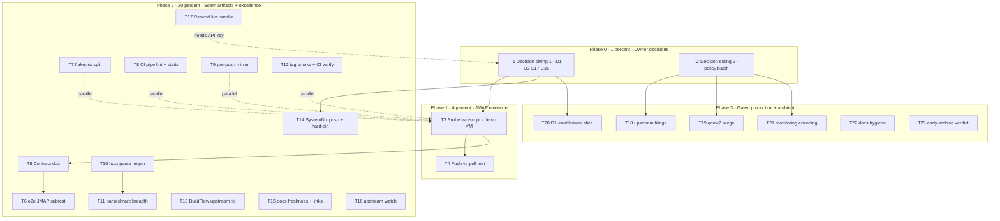

# SUPERB Pareto Execution Plan — nix-email backlog burn-down (2026-10-05)

> **STATUS (2026-10-05, post-execution): SUPERSEDED as a status source.**
> The per-task statuses below are PRE-execution. The authoritative
> verdicts live in `TODO_LIST.md` (struck rows with evidence) and
> `docs/status/2026-10-05_10-29_pareto-execution-jmap-seam-flake-split-ci-hardening.md`
> (15/23 tasks fully executed and verified; T13/T17/T19/T20/T21 remain
> gated as listed in this file's §4). Do NOT re-execute struck tasks
> from this file.

- **Date:** 2026-10-05 08:01 CEST (`date` CLI)
- **Input:** `TODO_LIST.md` (30 open rows: 4 High JMAP-seam, 2 Medium, 10 Low hygiene, 3 D1-gated, 11 user-blocked) + `docs/planning/decision-batch.md` (17 open owner calls, every one with a staged `[rec]`) + the 2026-10-05 status-report residue (7 unrouted-then-routed small items).
- **Repo state at planning time:** master ahead 8 of origin (daemon commits, unpushed); CI green last verified 2026-09-30 (pre-session); `buildflow` EXIT:69 = the 4 documented nix-checker port-collision FPs; all 5 checks green; docs/status active set = 0 (everything archived 2026-10-05).
- **Method:** pareto-planning skill — 1%→51%, 4%→64%, 20%→80% tiers, then ALL TODOs at 30–100 min (comprehensive), then ALL TODOs at ≤12 min (fine). Sorted by impact → effort → customer-value (customer = Lars as single maintainer + future flake consumers; the "product" is a verified, consumable mail-stack flake + the decided InboxClean seam).
- **Guardrail:** no verschlimmbessern — every task must leave repo and plan verifiably no worse (gates before yields, transcript-before-assertion, format-before-archive).

---

## 1. Pareto breakdown

### The 1% that delivers 51% — THE DECISION SITTING (T1 + T2)

~60 minutes of OWNER answers, zero implementation. 17 batched calls, all with staged recommendations:

- **D1/D2** alone gate ~15 todos AND the entire production half of the ROADMAP (VPS, Terraform DNS, migration, live dmarc, secrets rotation, monitoring encoding).
- **C35** unblocks all four High-impact JMAP rows (the only unblocked High work in the repo).
- **C17/C17a** unblocks SystemNix consumption (the flake's only consumer today).
- **C24/C29** unlock monitoring encoding; **C20/Q6** unlock three upstream filings; **C38/qcow2/C36/C37** retire standing ambiguity.

Nothing any agent session can execute delivers comparable leverage: the backlog's High tier is almost entirely decision-gated.

### The 4% that delivers 64% — JMAP EVIDENCE + ARTIFACT (T3 + T4 + T5)

~3–4 hours after C35: probe the demo VM (transcript first — the repo's own evidence-first rule), test push vs poll, write the contract doc with back-links. This produces:

1. The first **live-verified** JMAP facts (capability URNs, non-admin auth shape) — killing the "docs-verified, not live-probed" gap the 09-30 session flagged.
2. The **shared contract artifact** — the durable home for the decided InboxClean↔nix-email integration (closes "coordination is one-way").
3. The evidence base the e2e subtest and InboxClean's adapter spike both consume.

### The 20% that delivers 80% — SEAM COMPLETION + REPO EXCELLENCE + FLEET (T6–T14, T17)

The JMAP e2e subtest (contract becomes continuously verified), the `flake.nix` split (356 lines → modules; unblocks all future flake ergonomics), the CI/hook hardening pair + statix (mechanize the drift classes that shipped three red master runs), the host-parse helper (the 30s-dry-run lesson mechanized), parsedmarc breadth, tag smoke, the BuildFlow upstream fix (retires exit-69), the SystemNix push + hard-pin (fleet actually consumes v0.4.0), and the Resend live smoke (the last unverifiable relay claim).

### The other 20% (to reach 100%) — GATED PRODUCTION + AMBIENT (T15, T16, T18–T23)

Docs-freshness audits, upstream watch, the three upstream filings, qcow2 purge, docs hygiene batch, early-archive verdict — plus the two BLOCKED placeholders: the D1-gated enablement slice (secrets, live dmarc, migration compare, M22 provisioning) and the C24/C29-gated monitoring encoding. These execute the moment their gates clear; they are sequenced, not skippable — "include ALL TODOs" means they stay visible.

---

## 2. Comprehensive plan — 23 tasks, 30–100 min each (ALL TODOs)

Sorted by impact/effort/customer-value. Status: 🔴 open, ⏸ blocked-on-gate, 👤 owner-action.

| #   | Task                                                                                                                                        | Impact                 | Effort | Value         | Depends      | Covers TODO rows                                    |
| --- | ------------------------------------------------------------------------------------------------------------------------------------------- | ---------------------- | ------ | ------------- | ------------ | --------------------------------------------------- |
| T1  | 👤 Owner decision sitting #1 — the big gates: D1 (Workspace fork), D2 (VPS), C17+C17a (SystemNix push/pin), C35 (JMAP start)                | Critical               | 30m    | ★★★★★         | —            | decision-batch "big two" + C17 + C35                |
| T2  | 👤 Owner decision sitting #2 — policy batch: C18, C19, C20, C22, C34, Q4, Q5, Q6, C36, C37, C38, demo g1/g2, qcow2 verdict                  | Critical               | 30m    | ★★★★★         | —            | 9 user-blocked TODO rows + 5 decision-batch entries |
| T3  | JMAP probe transcript on demo VM: admin + non-admin (`roles: ["user"]`), capability URNs, README quickstart                                 | Critical               | 60m    | ★★★★★         | T1 (C35)     | JMAP probe row                                      |
| T4  | JMAP EventSource/push test → poll-vs-push verdict for InboxClean sync                                                                       | High                   | 90m    | ★★★★☆         | T3           | JMAP push-test row                                  |
| T5  | JMAP contract doc (`docs/INBOXCLEAN.md`): version/endpoint/auth/capabilities, TLS delta, label mapping, transcript rule, ADR-023 back-links | High                   | 60m    | ★★★★☆         | T3           | JMAP contract row                                   |
| T6  | `stalwart-e2e` JMAP subtest: seeded principal, session GET + mailbox query/get, ci.yml both-lists rule                                      | High                   | 100m   | ★★★★☆         | T3, T5       | JMAP e2e row                                        |
| T7  | Split `flake.nix` (356 lines) into `flake-modules/*.nix` per flake-parts idiom; eval guards immediately                                     | High                   | 100m   | ★★★★☆         | —            | flake-split Medium row                              |
| T14 | SystemNix consumption: hard-pin `?ref=v0.4.0`, push backlog, CI-debt triage, cache sweep, contract green                                    | High                   | 100m   | ★★★★☆         | T1           | SystemNix input row + SystemNix push row            |
| T17 | Resend live `:587` SASL smoke (real API key → real send → transcript)                                                                       | High                   | 30m    | ★★★★☆         | API key      | Resend row                                          |
| T8  | CI hardening pair: unescaped-pipe-in-table lint (fail-closed, negative-tested) + CI statix step                                             | Med                    | 60m    | ★★★☆☆         | —            | pipe-lint + statix rows                             |
| T9  | Pre-push hook mirrors CI check-inventory guards (x86_64 lockstep list + aarch64 shape)                                                      | Med                    | 45m    | ★★★☆☆         | —            | pre-push row                                        |
| T10 | `scripts/host-parse-fixture.py`: pinned-parser dry-run from the check drv closure (flake-app candidate)                                     | Med                    | 60m    | ★★★☆☆         | —            | host-parse row                                      |
| T11 | parsedmarc-e2e breadth: Netease + LinkedIn `.crlf` samples (host-dry-run first) + `arrival_date_utc`                                        | Med                    | 60m    | ★★★☆☆         | T10          | parsedmarc-breadth row                              |
| T13 | BuildFlow upstream: nix-checker context-scoping/suppression + dprint pipe-cell handling; retire exit-69                                     | Med                    | 100m   | ★★★☆☆         | —            | BuildFlow row                                       |
| T12 | v0.4.0 tag smoke (tag worktree: `nix flake show` + one VM boot) + CI-green check on pushed head                                             | Med                    | 30m    | ★★★☆☆         | —            | tag-smoke row + session residue 18                  |
| T15 | Docs freshness: TELEMETRY webhook/alert keys vs binary + CONTRIBUTING per-claim + REAL README link check                                    | Med                    | 60m    | ★★★☆☆         | —            | docs-freshness row + residue 20                     |
| T16 | Upstream watch: gh re-check 4 filings + imapclient 4.1.0 bump + presence-list procedure note                                                | Low                    | 30m    | ★★☆☆☆         | —            | watch + presence-list rows                          |
| T18 | Upstream filings batch: mailsuite STARTTLS (draft ready), parsedmarc Restart, Junk-filing (Q6=d only)                                       | Low                    | 60m    | ★★☆☆☆         | T2           | mailsuite + Restart + Junk rows                     |
| T19 | qcow2 history purge (~140 MB, filter-repo + daemon-pause + force-with-lease) or record accept verdict                                       | Low                    | 45m    | ★★☆☆☆         | T2           | qcow2 row                                           |
| T22 | Docs hygiene batch: format-before-archive AGENTS line, sub-bullet strike rule, AGENTS diet toward 15 KB                                     | Low                    | 30m    | ★★☆☆☆         | —            | archive-hygiene row + residue 19/21/22              |
| T23 | Early-archive check-rows verdict: fix-or-leave the 3 pre-2026-09-17 uniformity failures, record it                                          | Low                    | 30m    | ★★☆☆☆         | —            | residue 23                                          |
| T20 | ⏸ D1-gated enablement slice: rotate 3 secrets, dmarc-monitor live validation, migration compare, M22 start                                  | Critical-when-unlocked | 100m   | ★★★★★ (gated) | T1 (D1)      | 3 D1-gated rows + M22/M26 slices                    |
| T21 | ⏸ Monitoring encoding start: Gatus templates, queue poll, failed-auth, dead-man (per MONITORING.md)                                         | High-when-unlocked     | 100m   | ★★★★☆ (gated) | T2 (C24/C29) | monitoring rows                                     |

**Totals:** 23 tasks ≈ 20.4 h (≈ 14.4 h unblocked + 2.0 h owner + ~4 h gated slices). Unblocked execution order: T1/T2 → T3 → T4|T7|T8|T9|T10|T12|T15|T16 (parallelizable) → T5 → T6|T11 → T14|T17|T13 → T18|T19|T22|T23 → T20|T21 on gates.

---

## 3. Fine breakdown — 131 tasks, ≤12 min each (ALL TODOs)

Format: `ID (task · minutes)`. Groups marked ∥ are safe to run in parallel.

| Fine ID | Task (≤12 min each)                                                                                     | Min | Parent |
| ------- | ------------------------------------------------------------------------------------------------------- | --- | ------ |
| F1.1    | 👤 Answer D1 (rec: retire Workspace) in decision-batch                                                  | 5   | T1     |
| F1.2    | 👤 Answer D2 (rec: CX22, evo-x2 backup) in decision-batch                                               | 5   | T1     |
| F1.3    | 👤 Answer C17a pin choice (rec: hard-pin `?ref=v0.4.0`)                                                 | 5   | T1     |
| F1.4    | 👤 Approve C17 SystemNix push                                                                           | 5   | T1     |
| F1.5    | 👤 Answer C35 (rec: start JMAP spike now)                                                               | 2   | T1     |
| F1.6    | Record T1 answers as RESOLVED strikethroughs in decision-batch.md                                       | 10  | T1     |
| F1.7    | Harvest T1 unlocks: un-gate TODO rows, re-slice M22–M26 pointers                                        | 12  | T1     |
| F2.1    | 👤 C18 branch-bypass (rec: keep)                                                                        | 3   | T2     |
| F2.2    | 👤 C19 Renovate (rec: drop config)                                                                      | 3   | T2     |
| F2.3    | 👤 C20 mailsuite (rec: file it)                                                                         | 3   | T2     |
| F2.4    | 👤 C22 Discussions (rec: issues-only)                                                                   | 3   | T2     |
| F2.5    | 👤 C34 webmail (rec: non-goal)                                                                          | 3   | T2     |
| F2.6    | 👤 Q4 README detail level (rec: keep as-is)                                                             | 3   | T2     |
| F2.7    | 👤 Q5 provisioning (rec: add options)                                                                   | 3   | T2     |
| F2.8    | 👤 Q6 spam→Junk (rec: tag-only now + upstream ask)                                                      | 3   | T2     |
| F2.9    | 👤 C38 daemon flush (rec: ride the cycle)                                                               | 3   | T2     |
| F2.10   | 👤 Demo g1/g2 (rec: keep 18080 / yes add dmarc)                                                         | 3   | T2     |
| F2.11   | 👤 qcow2 verdict (purge vs accept weight)                                                               | 5   | T2     |
| F2.12   | 👤 C36 topology + C37 build order (rec: evo-x2 / corpus-first)                                          | 5   | T2     |
| F2.13   | Record T2 answers as RESOLVED strikethroughs; route verdicts (drop renovate.json? file issue? etc.)     | 12  | T2     |
| F3.1    | ∥ Scratch dir + boot demo VM (`nix run .#vm`; CWD-relative qcow2 rule)                                  | 10  | T3     |
| F3.2    | `curl :18080/.well-known/jmap` as admin; save transcript file                                           | 10  | T3     |
| F3.3    | Create non-admin principal via API with `roles: ["user"]`                                               | 10  | T3     |
| F3.4    | Authenticate as that user; session GET; save transcript                                                 | 10  | T3     |
| F3.5    | Extract capability URNs (core/mail/submission/push) pinned to transcript                                | 5   | T3     |
| F3.6    | Mailbox query/get probe as the user; save transcript                                                    | 10  | T3     |
| F3.7    | README "Try it in a VM": add JMAP curl quickstart                                                       | 12  | T3     |
| F3.8    | Commit transcript + README (detailed message)                                                           | 5   | T3     |
| F4.1    | Verify 0.15.5 EventSource/push endpoint shape against pinned source                                     | 12  | T4     |
| F4.2    | Open push connection from host; observe keepalive/event framing                                         | 12  | T4     |
| F4.3    | Trigger one delivery; capture the event transcript                                                      | 12  | T4     |
| F4.4    | Verdict: poll vs push for InboxClean sync; write it down with evidence                                  | 10  | T4     |
| F4.5    | Record verdict in contract notes + InboxClean row-173 pointer                                           | 10  | T4     |
| F4.6    | Teardown VM, drop GC roots, commit transcripts                                                          | 5   | T4     |
| F5.1    | Scaffold `docs/INBOXCLEAN.md` (home convention: upstream owns surface docs)                             | 10  | T5     |
| F5.2    | Pin Stalwart version + endpoint + auth model from probe transcript                                      | 10  | T5     |
| F5.3    | Capability list + test-account recipe (roles gotcha!)                                                   | 10  | T5     |
| F5.4    | TLS posture delta: demo plain-HTTP vs production ACME; insecure-skip demo-only                          | 8   | T5     |
| F5.5    | InboxClean-label ↔ JMAP-keyword/flag mapping table                                                      | 12  | T5     |
| F5.6    | Transcript rule across the contract boundary + reverse-proxy posture (8080 loopback)                    | 8   | T5     |
| F5.7    | Back-link from InboxClean ADR-023 + TODO row 173 (their repo, 2-line edits)                             | 8   | T5     |
| F5.8    | dprint format check + commit                                                                            | 5   | T5     |
| F6.1    | Seed JMAP test principal (`roles: ["user"]`) in the e2e fixture                                         | 12  | T6     |
| F6.2    | Session-get assertion: dump to file, grep the file (no pipes)                                           | 12  | T6     |
| F6.3    | Mailbox query/get assertions on a seeded message                                                        | 12  | T6     |
| F6.4    | Assertion-hygiene pass: pipe-lint + word-boundary rules                                                 | 8   | T6     |
| F6.5    | Build THAT check first: `nix build .#checks.x86_64-linux.stalwart-e2e -L`                               | 12  | T6     |
| F6.6    | If its own check: update BOTH ci.yml guard lists same commit                                            | 10  | T6     |
| F6.7    | Full gate + FEATURES.md row update                                                                      | 12  | T6     |
| F6.8    | Commit + push, watch CI                                                                                 | 5   | T6     |
| F7.1    | ∥ Survey flake-parts module idiom in SystemNix + telephony flakes (reference-first)                     | 12  | T7     |
| F7.2    | Map current flake.nix sections → target `flake-modules/*.nix` files (write the map down)                | 10  | T7     |
| F7.3    | Create `flake-modules/{checks,devshells,demo-vm,modules}.nix` skeletons                                 | 12  | T7     |
| F7.4    | Rewire top-level flake.nix to import them (outputs ellipsis + perSystem pkgs rules)                     | 10  | T7     |
| F7.5    | Run BOTH eval guards IMMEDIATELY (attrNames + aarch64 shape)                                            | 5   | T7     |
| F7.6    | deadnix + statix + `nix fmt -- . --check`                                                               | 8   | T7     |
| F7.7    | Full `nix flake check` (redirect log; grep execution lines — empty log = cache hit)                     | 12  | T7     |
| F7.8    | Verify exported surface unchanged (`nix flake show` before/after diff)                                  | 10  | T7     |
| F7.9    | AGENTS note (module layout) + commit                                                                    | 8   | T7     |
| F8.1    | Author pipe-count awk lint (odd pipes vs header; char-class boundaries, not `\b`)                       | 12  | T8     |
| F8.2    | Negative test: planted bad row MUST fail the lint                                                       | 10  | T8     |
| F8.3    | Wire into ci.yml after the alejandra step                                                               | 8   | T8     |
| F8.4    | Add CI statix step (`nix run nixpkgs#statix check`)                                                     | 10  | T8     |
| F8.5    | Verify lint catches the 2026-09-23 eaten-rows class (fixture replay)                                    | 10  | T8     |
| F8.6    | Commit + push, watch CI green                                                                           | 10  | T8     |
| F9.1    | Extract CI expected-list + aarch64 shape test into `scripts/check-inventory.sh`                         | 12  | T9     |
| F9.2    | Wire into `.githooks/pre-push` (absolute paths; systemd-PATH lesson N/A but hooksPath rule applies)     | 10  | T9     |
| F9.3    | Negative test: break the list locally → push must fail                                                  | 10  | T9     |
| F9.4    | Commit + CONTRIBUTING note (fresh clones re-set hooksPath)                                              | 5   | T9     |
| F10.1   | Prototype closure walk: `nix-store -q --references` + PYTHONPATH assembly                               | 12  | T10    |
| F10.2   | Write `scripts/host-parse-fixture.py` (fixture arg → pinned parser, closure python)                     | 12  | T10    |
| F10.3   | Run on the existing forensic fixture; result must match the VM's green output                           | 12  | T10    |
| F10.4   | Rewrite the AGENTS dry-run rule to the one-liner + example                                              | 8   | T10    |
| F10.5   | Commit (scripts/ is new — check no CI guard-list impact)                                                | 5   | T10    |
| F11.1   | Pin upstream Netease + LinkedIn `.crlf` failure samples (fetchurl + hashes; diff newest upstream first) | 12  | T11    |
| F11.2   | Host-dry-run both through F10 helper (parser blame before VM burn)                                      | 12  | T11    |
| F11.3   | Wire fixtures into the forensic subtest                                                                 | 12  | T11    |
| F11.4   | `arrival_date_utc` assertion (+0200 → UTC) from existing fixture                                        | 10  | T11    |
| F11.5   | Build that check, then full gate                                                                        | 12  | T11    |
| F12.1   | `gh run list`: verify CI green on the daemon-pushed head                                                | 5   | T12    |
| F12.2   | `git worktree add` at `v0.4.0` tag                                                                      | 5   | T12    |
| F12.3   | `nix flake show` + one `nix run .#vm` boot from the worktree                                            | 12  | T12    |
| F12.4   | Record verdict in TODO row; remove worktree                                                             | 8   | T12    |
| F13.1   | Repro both FP classes in the BuildFlow repo (port-collision + dprint pipe)                              | 12  | T13    |
| F13.2   | Design fix: same-config scoping + finding-level suppression + well-known-port downgrade                 | 12  | T13    |
| F13.3   | Implement port-collision scoping in `check_port_collisions.go`                                          | 12  | T13    |
| F13.4   | Implement dprint markdown pipe-cell handling                                                            | 12  | T13    |
| F13.5   | Tests + fixtures for both (BuildFlow repo standards)                                                    | 12  | T13    |
| F13.6   | Verify HERE: buildflow exits 0 with zero new findings                                                   | 12  | T13    |
| F13.7   | Retire the AGENTS known-noise entry + exit-69 posture notes                                             | 8   | T13    |
| F14.1   | SystemNix: hard-pin input `?ref=v0.4.0` (per C17a answer)                                               | 8   | T14    |
| F14.2   | Push the ≈47-commit backlog (normal push; linear history)                                               | 10  | T14    |
| F14.3a  | CI-debt: statix sweep in SystemNix                                                                      | 12  | T14    |
| F14.3b  | CI-debt: secret-scan `syn_` policy + gitleaks `rev=` allowlist                                          | 12  | T14    |
| F14.3c  | CI-debt: the 2 remaining pin flips                                                                      | 12  | T14    |
| F14.4   | Worktree cache sweep (`.cache/signoz-src`, `.cache/gatus-src`, `nixos.qcow2`)                           | 10  | T14    |
| F14.5   | `nix-email-contract` check green on the pushed head                                                     | 12  | T14    |
| F15.1   | TELEMETRY: verify webhook/alert-object keys against the pinned 0.15.5 binary                            | 12  | T15    |
| F15.2   | CONTRIBUTING per-claim pass (commands, paths, procedures)                                               | 12  | T15    |
| F15.3   | README link check PROPER (real pattern or lychee; fix what's dead)                                      | 12  | T15    |
| F15.4   | dprint + commit                                                                                         | 5   | T15    |
| F16.1   | `gh` re-check nixpkgs #563651/#563652/#563777 + imapclient 4.1.0 bump state                             | 10  | T16    |
| F16.2   | Update the TODO watch-row evidence cells                                                                | 5   | T16    |
| F16.3   | Presence-list re-verify procedure note for the NEXT pin bump                                            | 10  | T16    |
| F17.1   | Configure `relay.secretFile` with the real Resend key on a scratch host                                 | 10  | T17    |
| F17.2   | One real `:587` submission through smtp.resend.com                                                      | 10  | T17    |
| F17.3   | Assert delivery; ledger the transcript; close the TODO row                                              | 10  | T17    |
| F18.1   | File mailsuite STARTTLS issue from the ready draft (github-voice skill)                                 | 12  | T18    |
| F18.2   | parsedmarc Restart proposal (verify-before-filing gates first)                                          | 12  | T18    |
| F18.3   | Junk-filing upstream ask (only if Q6 landed on option d)                                                | 12  | T18    |
| F18.4   | Cross-link all three in the README external-issues ledger                                               | 8   | T18    |
| F19.1   | Daemon-pause window + `git filter-repo` strip the 5 qcow2 blobs                                         | 12  | T19    |
| F19.2   | `--force-with-lease` push (verdict = approval)                                                          | 5   | T19    |
| F19.3   | Fresh-clone weight check + local re-clone verification                                                  | 12  | T19    |
| F19.4   | gc + TODO row close-out                                                                                 | 8   | T19    |
| F20.1   | ⏸ Rotate the 3 placeholder secrets + sops-key-audit confirm (D1)                                        | 12  | T20    |
| F20.2   | ⏸ dmarc-monitor live validation vs the real rua mailbox (D1)                                            | 12  | T20    |
| F20.3   | ⏸ Migration compare: vandelay vs imapsync on scratch mailboxes (D1)                                     | 12  | T20    |
| F20.4   | ⏸ M22 slice 1: provisioning oneshot + DKIM keygen automation (D1)                                       | 12  | T20    |
| F21.1   | ⏸ Gatus external-view checks (starttls :25, tls :993, cert expiry) (C24/C29)                            | 12  | T21    |
| F21.2   | ⏸ Queue-depth/age poll alert off `GET /api/queue/messages` (C24/C29)                                    | 12  | T21    |
| F21.3   | ⏸ Failed-auth burst rule from tracing/journal (C24/C29)                                                 | 12  | T21    |
| F21.4   | ⏸ Dead-man switch on the monitors themselves (C24/C29)                                                  | 12  | T21    |
| F22.1   | Add format-before-archive line to the AGENTS archive-policy bullet                                      | 5   | T22    |
| F22.2   | Decide + record the sub-bullet strike rule (one line, AGENTS)                                           | 5   | T22    |
| F22.3   | AGENTS.md diet pass toward 15 KB (compress dated lessons into rules)                                    | 12  | T22    |
| F22.4   | dprint + commit                                                                                         | 5   | T22    |
| F23.1   | Diff the 3 early-archive check-rows failures; decide fix-or-leave                                       | 12  | T23    |
| F23.2   | If fix: scripted cell-wise uniformize + check-rows green                                                | 12  | T23    |
| F23.3   | Record the verdict in the archive README manifest                                                       | 5   | T23    |

**Totals:** 131 fine tasks, ≈ 19.2 h. Unblocked-now (excl. ⏸/👤): 105 tasks ≈ 14.3 h.

---

## 4. Execution graph (mermaid)

**Critical path:** T1 → T3 → T5 → T6 (≈ 4.2 h after the sitting). The single highest-leverage non-owner action is **T3**.

---

## 5. Verification plan (per tier)

- **Owner decisions:** recorded as RESOLVED strikethroughs in decision-batch.md; unlocks harvested into TODO_LIST same sitting.
- **JMAP work:** transcripts saved before assertions; every contract-doc claim cites a transcript line (repo's no-assertion-without-transcript rule); e2e additions build THAT check first, then the full gate.
- **Repo excellence:** eval guards immediately after any flake-structure write; `nix fmt -- . --check` before yield; exported-surface diff proves the split is behavior-neutral.
- **Every task:** gates before commit; format-before-archive; no pipes on gate commands (redirect + read).
